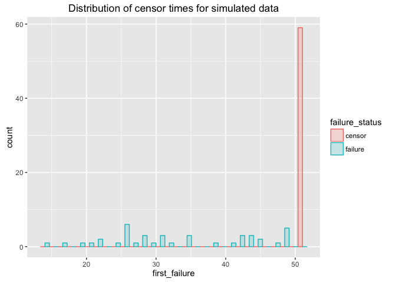

Test generative model using CmdStan
================
Jacqueline Buros
May 20, 2016

Intro
-----

This is a short analysis to test various options for estimating the "generative" model in Stan, and specifically using CmdStan.

There are several reasons why I'm looking at using CmdStan:

1.  Rstan is prone to fail/crash at some point, particularly for long-running jobs

-   preliminary testing shows that these models will take a while to run

1.  Better diagnostics & more up to date codebase (e.g. support for stiff odes) with CmdStan
2.  Having problems running R on dev nodes (more about this later ... )

Simulated data
--------------

Data were simulated according to the `simulate_data()` function. See that function for more details.

Here we will use standard functions designed to help in post-processing of the simulated data.

``` r
set.seed(1234)
d <- simulate_data(n = 100, max_size = 4000, max_t = 50, failure_threshold = 4, progression_threshold = 3)
make_data_plots(d)
```

    ## Saving 7 x 5 in image

<!-- -->

    ## Saving 7 x 5 in image

<!-- -->

    ## `stat_bin()` using `bins = 30`. Pick better value with `binwidth`.
    ## Saving 7 x 5 in image

    ## `stat_bin()` using `bins = 30`. Pick better value with `binwidth`.

<!-- -->

We will next prepare two data files for analysis - one *per patient*, which will be suitable for survival analysis, and another *per observation*. This latter, *per-observation* dataset is the one we will predominantly pass to cmdstan.

``` r
res <- prep_data(d)
```

    ## Source: local data frame [3 x 4]
    ## 
    ##   failure_status failure_or_progression_status     n percent
    ##            (dbl)                         (dbl) (int)   (chr)
    ## 1              0                             0    13     13%
    ## 2              0                             1    46     46%
    ## 3              1                             1    41     41%

``` r
adata <- res$per_observation
survd <- res$per_patient
rm(res)
```

Standard models
---------------

Just for kicks, let's run a few standard models on this data.

We will focus on two covariates in particular -

1.  Initial tumor size (observed)
2.  Avg rate of change in tumor size: (final - initial) / time

We can look at these in terms of failure (survival), or the combintion of disease progression and/or failure.

#### with failure as the outcome

Looking at initial tumor size as a predictor :

``` r
survfit1 <- coxph(
  formula = Surv(first_failure, failure_status) ~ rescaled_init_size
  , data = survd
  )
print(survfit1)
```

    ## Call:
    ## coxph(formula = Surv(first_failure, failure_status) ~ rescaled_init_size, 
    ##     data = survd)
    ## 
    ## 
    ##                     coef exp(coef) se(coef)    z    p
    ## rescaled_init_size 0.192     1.211    0.158 1.22 0.22
    ## 
    ## Likelihood ratio test=1.49  on 1 df, p=0.222
    ## n= 100, number of events= 41

And, including change in tumor size :

``` r
survfit <- coxph(
  formula = Surv(first_failure, failure_status) ~ rescaled_init_size + rescaled_growth_rate
  , data = survd
  )
print(survfit)
```

    ## Call:
    ## coxph(formula = Surv(first_failure, failure_status) ~ rescaled_init_size + 
    ##     rescaled_growth_rate, data = survd)
    ## 
    ## 
    ##                        coef exp(coef) se(coef)    z       p
    ## rescaled_init_size    0.798     2.220    0.189 4.21 2.5e-05
    ## rescaled_growth_rate  2.472    11.842    0.308 8.01 1.1e-15
    ## 
    ## Likelihood ratio test=115  on 2 df, p=0
    ## n= 100, number of events= 41

#### with progression/failure as the outcome

Looking at initial tumor size as a predictor :

``` r
survfit <- coxph(
  formula = Surv(first_failure_or_progression, failure_or_progression_status) ~ rescaled_init_size
  , data = survd
  )
print(survfit)
```

    ## Call:
    ## coxph(formula = Surv(first_failure_or_progression, failure_or_progression_status) ~ 
    ##     rescaled_init_size, data = survd)
    ## 
    ## 
    ##                      coef exp(coef) se(coef)    z    p
    ## rescaled_init_size 0.0786    1.0818   0.1110 0.71 0.48
    ## 
    ## Likelihood ratio test=0.5  on 1 df, p=0.478
    ## n= 100, number of events= 87

And, including change in tumor size :

``` r
survfit <- coxph(
  formula = Surv(first_failure_or_progression, failure_or_progression_status) ~ rescaled_init_size + rescaled_growth_rate
  , data = survd
  )
print(survfit)
```

    ## Call:
    ## coxph(formula = Surv(first_failure_or_progression, failure_or_progression_status) ~ 
    ##     rescaled_init_size + rescaled_growth_rate, data = survd)
    ## 
    ## 
    ##                       coef exp(coef) se(coef)    z       p
    ## rescaled_init_size   0.116     1.123    0.112 1.04     0.3
    ## rescaled_growth_rate 0.734     2.084    0.124 5.90 3.6e-09
    ## 
    ## Likelihood ratio test=29.1  on 2 df, p=4.69e-07
    ## n= 100, number of events= 87

Stan code for basic survival model
----------------------------------

We have Stan code for the basic survival model. Let's run it now just to get a sense of how it works.

``` r
standata <- list(
  N = nrow(adata)
  , S = max(adata$patid)
  , T = max(adata$t)
  , X = 1
  , s = adata$patid
  , t = adata$t
  , event = adata$failure
  , covars = adata %>% dplyr::select(rescaled_init_size)
)

testfit <- stan('long_surv.stan', data = standata, chains = 1, iter = 10)
```

    ## 
    ## SAMPLING FOR MODEL 'long_surv' NOW (CHAIN 1).
    ## 
    ## Chain 1, Iteration: 1 / 10 [ 10%]  (Warmup)
    ## Chain 1, Iteration: 2 / 10 [ 20%]  (Warmup)
    ## Chain 1, Iteration: 3 / 10 [ 30%]  (Warmup)
    ## Chain 1, Iteration: 4 / 10 [ 40%]  (Warmup)
    ## Chain 1, Iteration: 5 / 10 [ 50%]  (Warmup)
    ## Chain 1, Iteration: 6 / 10 [ 60%]  (Sampling)
    ## Chain 1, Iteration: 7 / 10 [ 70%]  (Sampling)
    ## Chain 1, Iteration: 8 / 10 [ 80%]  (Sampling)
    ## Chain 1, Iteration: 9 / 10 [ 90%]  (Sampling)
    ## Chain 1, Iteration: 10 / 10 [100%]  (Sampling)# 
    ## #  Elapsed Time: 0.053329 seconds (Warm-up)
    ## #                0.046229 seconds (Sampling)
    ## #                0.099558 seconds (Total)
    ## #

    ## The following numerical problems occured the indicated number of times after warmup on chain 1

    ##                                                                                       count
    ## validate transformed params: hazard[5] is nan, but must be greater than or equal to 0     2
    ## validate transformed params: hazard[1] is nan, but must be greater than or equal to 0     1

    ## When a numerical problem occurs, the Metropolis proposal gets rejected.

    ## However, by design Metropolis proposals sometimes get rejected even when there are no numerical problems.

    ## Thus, if the number in the 'count' column is small, do not ask about this message on stan-users.

``` r
stanfit <- stan('long_surv.stan', data = standata, chains = 3, iter = 1000)

print(stanfit, 'beta')
```

    ## Inference for Stan model: long_surv.
    ## 3 chains, each with iter=1000; warmup=500; thin=1; 
    ## post-warmup draws per chain=500, total post-warmup draws=1500.
    ## 
    ##         mean se_mean  sd 2.5%  25%  50%  75% 97.5% n_eff Rhat
    ## beta[1] 0.11       0 0.1 -0.1 0.04 0.12 0.19  0.32  1500    1
    ## 
    ## Samples were drawn using NUTS(diag_e) at Fri May 20 15:38:54 2016.
    ## For each parameter, n_eff is a crude measure of effective sample size,
    ## and Rhat is the potential scale reduction factor on split chains (at 
    ## convergence, Rhat=1).

Now, this is not *identical* to the survival analysis, but we should see very similar results to the estimates we got from `coxph`.

Let's confirm this now.

``` r
print(survfit1)
```

    ## Call:
    ## coxph(formula = Surv(first_failure, failure_status) ~ rescaled_init_size, 
    ##     data = survd)
    ## 
    ## 
    ##                     coef exp(coef) se(coef)    z    p
    ## rescaled_init_size 0.192     1.211    0.158 1.22 0.22
    ## 
    ## Likelihood ratio test=1.49  on 1 df, p=0.222
    ## n= 100, number of events= 41

Semi-competing risks model
--------------------------

We additionally have Stan code for a semi-competing risks model. This analysis will be summarized separately.

Generative model
----------------

We are finally working on what I'll call the "generative model" -- this is the model that more closely mimics the data generating process we hypothesized might be at work.

The code right now is making use of the `integrate_ode` function in Stan.

We will first review how this works & then test out the implementation using CmdStan.

### Ex 1: using stan to simulate data

Here is the stan file :

``` r
file.show('generative_model_sim_data.stan')
```

``` r
## pick a random patient; pass these parameters to the stan file 
sample_data <- adata %>% semi_join(adata %>% sample_n(1) %>% dplyr::select(patid), by = 'patid')

sample_params <- list(
  N_obs = nrow(sample_data)
  , obs_t = sample_data$t
  , init_vol = unique(sample_data$init_size)
  , growth_rate = unique(sample_data$growth_rate)
  , max_size = 4000
)
testfit <- stan('generative_model_sim_data.stan', data = sample_params, chains = 1, iter = 100, algorithm = 'Fixed_param')
```

    ## 
    ## SAMPLING FOR MODEL 'generative_model_sim_data' NOW (CHAIN 1).
    ## Warning: warmup will be skipped for the fixed parameter sampler!
    ## 
    ## Chain 1, Iteration:  1 / 100 [  1%]  (Sampling)
    ## Chain 1, Iteration: 10 / 100 [ 10%]  (Sampling)
    ## Chain 1, Iteration: 20 / 100 [ 20%]  (Sampling)
    ## Chain 1, Iteration: 30 / 100 [ 30%]  (Sampling)
    ## Chain 1, Iteration: 40 / 100 [ 40%]  (Sampling)
    ## Chain 1, Iteration: 50 / 100 [ 50%]  (Sampling)
    ## Chain 1, Iteration: 60 / 100 [ 60%]  (Sampling)
    ## Chain 1, Iteration: 70 / 100 [ 70%]  (Sampling)
    ## Chain 1, Iteration: 80 / 100 [ 80%]  (Sampling)
    ## Chain 1, Iteration: 90 / 100 [ 90%]  (Sampling)
    ## Chain 1, Iteration: 100 / 100 [100%]  (Sampling)# 
    ## #  Elapsed Time: 8e-06 seconds (Warm-up)
    ## #                0.012716 seconds (Sampling)
    ## #                0.012724 seconds (Total)
    ## #

``` r
print(testfit)
```

    ## Inference for Stan model: generative_model_sim_data.
    ## 1 chains, each with iter=100; warmup=50; thin=1; 
    ## post-warmup draws per chain=50, total post-warmup draws=50.
    ## 
    ##                    mean se_mean sd    2.5%     25%     50%     75%   97.5%
    ## tumor_vol[1,1]     1.05       0  0    1.05    1.05    1.05    1.05    1.05
    ## tumor_vol[2,1]     1.44       0  0    1.44    1.44    1.44    1.44    1.44
    ## tumor_vol[3,1]     1.97       0  0    1.97    1.97    1.97    1.97    1.97
    ## tumor_vol[4,1]     2.70       0  0    2.70    2.70    2.70    2.70    2.70
    ## tumor_vol[5,1]     3.69       0  0    3.69    3.69    3.69    3.69    3.69
    ## tumor_vol[6,1]     5.06       0  0    5.06    5.06    5.06    5.06    5.06
    ## tumor_vol[7,1]     6.93       0  0    6.93    6.93    6.93    6.93    6.93
    ## tumor_vol[8,1]     9.49       0  0    9.49    9.49    9.49    9.49    9.49
    ## tumor_vol[9,1]    12.99       0  0   12.99   12.99   12.99   12.99   12.99
    ## tumor_vol[10,1]   17.77       0  0   17.77   17.77   17.77   17.77   17.77
    ## tumor_vol[11,1]   24.31       0  0   24.31   24.31   24.31   24.31   24.31
    ## tumor_vol[12,1]   33.23       0  0   33.23   33.23   33.23   33.23   33.23
    ## tumor_vol[13,1]   45.39       0  0   45.39   45.39   45.39   45.39   45.39
    ## tumor_vol[14,1]   61.92       0  0   61.92   61.92   61.92   61.92   61.92
    ## tumor_vol[15,1]   84.36       0  0   84.36   84.36   84.36   84.36   84.36
    ## tumor_vol[16,1]  114.68       0  0  114.68  114.68  114.68  114.68  114.68
    ## tumor_vol[17,1]  155.48       0  0  155.48  155.48  155.48  155.48  155.48
    ## tumor_vol[18,1]  210.00       0  0  210.00  210.00  210.00  210.00  210.00
    ## tumor_vol[19,1]  282.24       0  0  282.24  282.24  282.24  282.24  282.24
    ## tumor_vol[20,1]  376.85       0  0  376.85  376.85  376.85  376.85  376.85
    ## tumor_vol[21,1]  498.93       0  0  498.93  498.93  498.93  498.93  498.93
    ## tumor_vol[22,1]  653.42       0  0  653.42  653.42  653.42  653.42  653.42
    ## tumor_vol[23,1]  844.21       0  0  844.21  844.21  844.21  844.21  844.21
    ## tumor_vol[24,1] 1072.84       0  0 1072.84 1072.84 1072.84 1072.84 1072.84
    ## tumor_vol[25,1] 1337.17       0  0 1337.17 1337.17 1337.17 1337.17 1337.17
    ## tumor_vol[26,1] 1630.34       0  0 1630.34 1630.34 1630.34 1630.34 1630.34
    ## tumor_vol[27,1] 1940.94       0  0 1940.94 1940.94 1940.94 1940.94 1940.94
    ## tumor_vol[28,1] 2254.43       0  0 2254.43 2254.43 2254.43 2254.43 2254.43
    ## tumor_vol[29,1] 2555.69       0  0 2555.69 2555.69 2555.69 2555.69 2555.69
    ## tumor_vol[30,1] 2831.90       0  0 2831.90 2831.90 2831.90 2831.90 2831.90
    ## tumor_vol[31,1] 3074.42       0  0 3074.42 3074.42 3074.42 3074.42 3074.42
    ## tumor_vol[32,1] 3279.40       0  0 3279.40 3279.40 3279.40 3279.40 3279.40
    ## tumor_vol[33,1] 3447.15       0  0 3447.15 3447.15 3447.15 3447.15 3447.15
    ## tumor_vol[34,1] 3580.84       0  0 3580.84 3580.84 3580.84 3580.84 3580.84
    ## tumor_vol[35,1] 3685.15       0  0 3685.15 3685.15 3685.15 3685.15 3685.15
    ## tumor_vol[36,1] 3765.21       0  0 3765.21 3765.21 3765.21 3765.21 3765.21
    ## tumor_vol[37,1] 3825.87       0  0 3825.87 3825.87 3825.87 3825.87 3825.87
    ## tumor_vol[38,1] 3871.40       0  0 3871.40 3871.40 3871.40 3871.40 3871.40
    ## tumor_vol[39,1] 3905.31       0  0 3905.31 3905.31 3905.31 3905.31 3905.31
    ## tumor_vol[40,1] 3930.44       0  0 3930.44 3930.44 3930.44 3930.44 3930.44
    ## tumor_vol[41,1] 3948.99       0  0 3948.99 3948.99 3948.99 3948.99 3948.99
    ## tumor_vol[42,1] 3962.64       0  0 3962.64 3962.64 3962.64 3962.64 3962.64
    ## tumor_vol[43,1] 3972.66       0  0 3972.66 3972.66 3972.66 3972.66 3972.66
    ## tumor_vol[44,1] 3980.01       0  0 3980.01 3980.01 3980.01 3980.01 3980.01
    ## tumor_vol[45,1] 3985.39       0  0 3985.39 3985.39 3985.39 3985.39 3985.39
    ## tumor_vol[46,1] 3989.33       0  0 3989.33 3989.33 3989.33 3989.33 3989.33
    ## tumor_vol[47,1] 3992.20       0  0 3992.20 3992.20 3992.20 3992.20 3992.20
    ## tumor_vol[48,1] 3994.31       0  0 3994.31 3994.31 3994.31 3994.31 3994.31
    ## tumor_vol[49,1] 3995.84       0  0 3995.84 3995.84 3995.84 3995.84 3995.84
    ## theta[1]           0.31       0  0    0.31    0.31    0.31    0.31    0.31
    ## theta[2]        4000.00       0  0 4000.00 4000.00 4000.00 4000.00 4000.00
    ## init_state[1]      0.77       0  0    0.77    0.77    0.77    0.77    0.77
    ## lp__               0.00       0  0    0.00    0.00    0.00    0.00    0.00
    ##                 n_eff Rhat
    ## tumor_vol[1,1]      1 0.98
    ## tumor_vol[2,1]      1 0.98
    ## tumor_vol[3,1]      1 0.98
    ## tumor_vol[4,1]      1  NaN
    ## tumor_vol[5,1]     50  NaN
    ## tumor_vol[6,1]      1 0.98
    ## tumor_vol[7,1]      1 0.98
    ## tumor_vol[8,1]      1 0.98
    ## tumor_vol[9,1]      1 0.98
    ## tumor_vol[10,1]     1 0.98
    ## tumor_vol[11,1]     1 0.98
    ## tumor_vol[12,1]     1 0.98
    ## tumor_vol[13,1]    50 0.98
    ## tumor_vol[14,1]     1 0.98
    ## tumor_vol[15,1]     1 0.98
    ## tumor_vol[16,1]     1 0.98
    ## tumor_vol[17,1]     1 0.98
    ## tumor_vol[18,1]    50  NaN
    ## tumor_vol[19,1]     1 0.98
    ## tumor_vol[20,1]     1 0.98
    ## tumor_vol[21,1]     1 0.98
    ## tumor_vol[22,1]    50  NaN
    ## tumor_vol[23,1]     1 0.98
    ## tumor_vol[24,1]    50  NaN
    ## tumor_vol[25,1]     1 0.98
    ## tumor_vol[26,1]     1 0.98
    ## tumor_vol[27,1]     1 0.98
    ## tumor_vol[28,1]     1 0.98
    ## tumor_vol[29,1]     1 0.98
    ## tumor_vol[30,1]     1 0.98
    ## tumor_vol[31,1]     1 0.98
    ## tumor_vol[32,1]     1 0.98
    ## tumor_vol[33,1]     1 0.98
    ## tumor_vol[34,1]     1  NaN
    ## tumor_vol[35,1]     1 0.98
    ## tumor_vol[36,1]     1  NaN
    ## tumor_vol[37,1]     1 0.98
    ## tumor_vol[38,1]     1 0.98
    ## tumor_vol[39,1]     1 0.98
    ## tumor_vol[40,1]     1 0.98
    ## tumor_vol[41,1]     1 0.98
    ## tumor_vol[42,1]    50 0.98
    ## tumor_vol[43,1]     1 0.98
    ## tumor_vol[44,1]     1 0.98
    ## tumor_vol[45,1]     1 0.98
    ## tumor_vol[46,1]     1 0.98
    ## tumor_vol[47,1]     1 0.98
    ## tumor_vol[48,1]    50  NaN
    ## tumor_vol[49,1]     1 0.98
    ## theta[1]            1 0.98
    ## theta[2]           50  NaN
    ## init_state[1]       1 0.98
    ## lp__               50  NaN
    ## 
    ## Samples were drawn using (diag_e) at Fri May 20 15:39:12 2016.
    ## For each parameter, n_eff is a crude measure of effective sample size,
    ## and Rhat is the potential scale reduction factor on split chains (at 
    ## convergence, Rhat=1).

### Ex 2: estimating parameters for a single patient

Next we want to try to use `Stan` to estimate the growth rate for a single patient's tumor.

We will try to set this up as a "best case" scenario, where we will tell Stan what the max-size is, and we will also estimate this using actual *tumor size* measurements, instead of the diameter measurements (with measurement error) that were simulated.

Here is the stan file we'll be using to estimate this:

``` r
file.show('generative_model_single_obs_more_params.stan')
```

#### invoking CmdStan

The process for invoking this from CmdStan involves a few steps :

1.  Write out data to file
2.  Call "make" to translate *.stan -&gt; *.cpp -&gt; executable
3.  invoke executable on the data file, with params (possibly multiple chains)

Written in R code, this looks like :

#### invoking rstan
