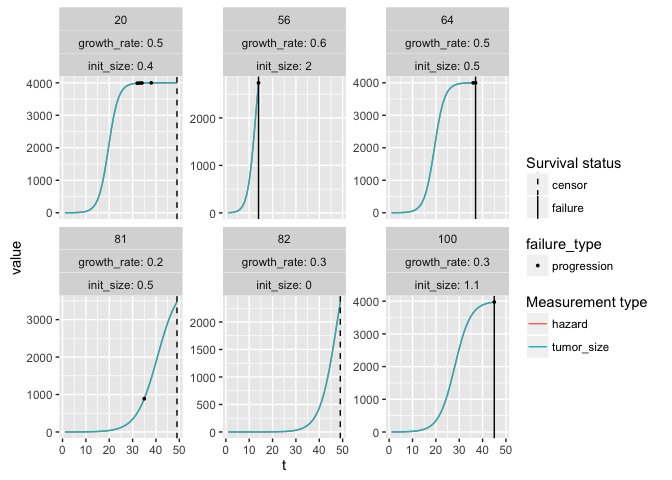
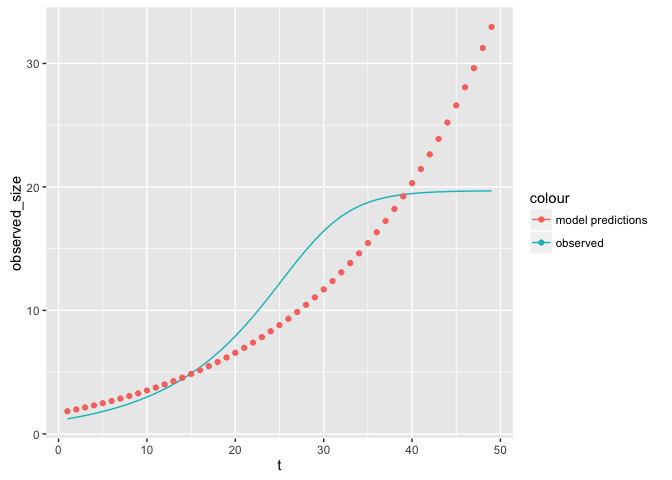
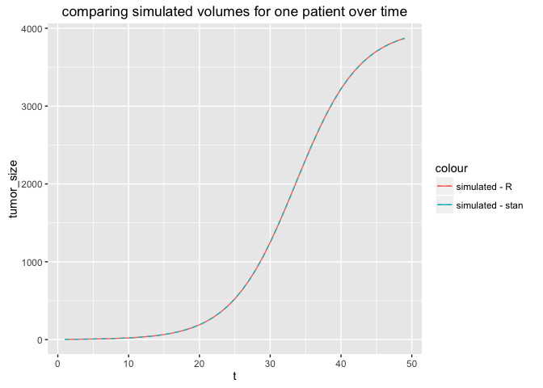
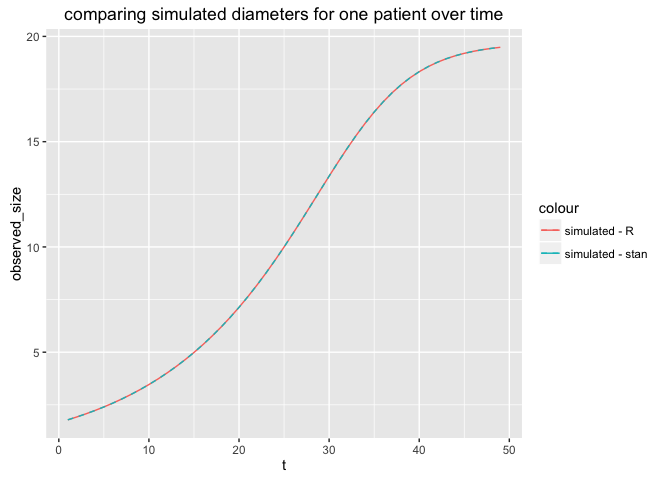

Test-growth-model.Rmd
================
Jacqueline Buros
May 23, 2016

Simulate data
-------------

Simulate data using standard functions.

Changes from previous versions: 1. remove all sources of noise 2. make hazard directly proportional to size of tumor

``` r
source('simulate-data.function.R')
source('prep-data.function.R')
source('make-data-plots.function.R')

data <- simulate_data(n = 100
                      , max_size = 4000
                      , max_t = 50
                      , failure_threshold = 4
                      , progression_threshold = 3
                      , size_noise_fun = create_scalar(0)
                      , growth_rate_noise_fun = create_scalar(0)
                      , hazard_noise_fun = create_scalar(0)
                      , hazard_fun = function(row) {row$tumor_size} ## for now, hazard proportional to size
                      )

## prep data for analysis
res <- prep_data(data) 
```

    ## Source: local data frame [3 x 4]
    ## 
    ##   failure_status failure_or_progression_status     n percent
    ##            (dbl)                         (dbl) (int)   (chr)
    ## 1              0                             0    18     18%
    ## 2              0                             1    51     51%
    ## 3              1                             1    31     31%

``` r
survd <- res$per_patient ## summarized per patient; appropriate for typical survival analysis
adata <- res$per_observation ## denormalized; appropriate for longitudinal analysis
rm(res)

## review data for a few simulated points
plot_simulated_data(data, n = 6)
```

<!-- -->

Test growth model using lme4 / lmer
-----------------------------------

``` r
growthfit <- lmer(rescaled_patient_observed_size ~ t + rescaled_init_size + 
                    (1 + t || patid)
                  , data = adata
                  )
display(growthfit)        
```

    ## lmer(formula = rescaled_patient_observed_size ~ t + rescaled_init_size + 
    ##     ((1 | patid) + (0 + t | patid)), data = adata)
    ##                    coef.est coef.se
    ## (Intercept)        -1.66     0.01  
    ## t                   0.07     0.00  
    ## rescaled_init_size  0.01     0.01  
    ## 
    ## Error terms:
    ##  Groups   Name        Std.Dev.
    ##  patid    (Intercept) 0.00    
    ##  patid.1  t           0.02    
    ##  Residual             0.31    
    ## ---
    ## number of obs: 4557, groups: patid, 100
    ## AIC = 2664.9, DIC = 2601
    ## deviance = 2626.9

How well does this fit?

``` r
adata$pd <- predict(growthfit)
ggplot(adata %>% semi_join(adata %>% sample_n(1), by = 'patid')
       , aes(x = t, group = patid)
       ) +
  geom_line(aes(y = rescaled_patient_observed_size, colour = 'observed')) + 
  geom_point(aes(y = pd, colour = 'model predictions'))
```

<!-- -->

Need to transform data, since we are modeling a % growth rate

``` r
growthfit2 <- lmer(log1p(observed_size) ~ t + rescaled_init_size + 
                    (1 + t || patid)
                  , data = adata
)
display(growthfit2)
```

    ## lmer(formula = log1p(observed_size) ~ t + rescaled_init_size + 
    ##     ((1 | patid) + (0 + t | patid)), data = adata)
    ##                    coef.est coef.se
    ## (Intercept)        1.04     0.02   
    ## t                  0.05     0.00   
    ## rescaled_init_size 0.26     0.02   
    ## 
    ## Error terms:
    ##  Groups   Name        Std.Dev.
    ##  patid    (Intercept) 0.21    
    ##  patid.1  t           0.01    
    ##  Residual             0.26    
    ## ---
    ## number of obs: 4557, groups: patid, 100
    ## AIC = 1168.8, DIC = 1110.5
    ## deviance = 1133.6

See if fit improves

``` r
adata$pd2 <- expm1(predict(growthfit2))
ggplot(adata %>% semi_join(adata %>% sample_n(1), by = 'patid')
       , aes(x = t, group = patid)
) +
  geom_line(aes(y = observed_size, colour = 'observed')) + 
  geom_point(aes(y = pd2, colour = 'model predictions'))
```

<!-- -->

Checking Stan code by using it to simulate data
-----------------------------------------------

First thing we're going to do is double-check the Stan code by using it to simulate the data for one patient. The data simulated using Stan should match that simulated using R exactly.

``` r
## pick random patient
sample_data <- adata %>% semi_join(adata %>% sample_n(1) %>% dplyr::select(patid), by = 'patid')
plot_simulated_data(sample_data, n = NULL)
```

<!-- -->

``` r
## what does simulated data look like according to these params?
## make sure data simulated according to R match those according to Stan
sample_params <- list(
  N_obs = nrow(sample_data)
  , obs_t = sample_data$t
  , init_vol = unique(sample_data$init_size)
  , growth_rate = unique(sample_data$growth_rate)
  , max_size = 4000
)
stangen <- stan('generative_model_sim_data.stan', data = sample_params, chains = 1, iter = 5, algorithm = 'Fixed_param')
```

    ## 
    ## SAMPLING FOR MODEL 'generative_model_sim_data' NOW (CHAIN 1).
    ## Warning: warmup will be skipped for the fixed parameter sampler!
    ## 
    ## Chain 1, Iteration: 1 / 5 [ 20%]  (Sampling)
    ## Chain 1, Iteration: 2 / 5 [ 40%]  (Sampling)
    ## Chain 1, Iteration: 3 / 5 [ 60%]  (Sampling)
    ## Chain 1, Iteration: 4 / 5 [ 80%]  (Sampling)
    ## Chain 1, Iteration: 5 / 5 [100%]  (Sampling)# 
    ## #  Elapsed Time: 5e-06 seconds (Warm-up)
    ## #                0.000605 seconds (Sampling)
    ## #                0.00061 seconds (Total)
    ## #

``` r
print(stangen, pars = 'tumor_vol')
```

    ## Inference for Stan model: generative_model_sim_data.
    ## 1 chains, each with iter=5; warmup=2; thin=1; 
    ## post-warmup draws per chain=3, total post-warmup draws=3.
    ## 
    ##                    mean se_mean sd    2.5%     25%     50%     75%   97.5%
    ## tumor_vol[1,1]     2.99       0  0    2.99    2.99    2.99    2.99    2.99
    ## tumor_vol[2,1]     3.73       0  0    3.73    3.73    3.73    3.73    3.73
    ## tumor_vol[3,1]     4.65       0  0    4.65    4.65    4.65    4.65    4.65
    ## tumor_vol[4,1]     5.80       0  0    5.80    5.80    5.80    5.80    5.80
    ## tumor_vol[5,1]     7.23       0  0    7.23    7.23    7.23    7.23    7.23
    ## tumor_vol[6,1]     9.02       0  0    9.02    9.02    9.02    9.02    9.02
    ## tumor_vol[7,1]    11.24       0  0   11.24   11.24   11.24   11.24   11.24
    ## tumor_vol[8,1]    14.01       0  0   14.01   14.01   14.01   14.01   14.01
    ## tumor_vol[9,1]    17.46       0  0   17.46   17.46   17.46   17.46   17.46
    ## tumor_vol[10,1]   21.76       0  0   21.76   21.76   21.76   21.76   21.76
    ## tumor_vol[11,1]   27.10       0  0   27.10   27.10   27.10   27.10   27.10
    ## tumor_vol[12,1]   33.74       0  0   33.74   33.74   33.74   33.74   33.74
    ## tumor_vol[13,1]   42.00       0  0   42.00   42.00   42.00   42.00   42.00
    ## tumor_vol[14,1]   52.25       0  0   52.25   52.25   52.25   52.25   52.25
    ## tumor_vol[15,1]   64.96       0  0   64.96   64.96   64.96   64.96   64.96
    ## tumor_vol[16,1]   80.70       0  0   80.70   80.70   80.70   80.70   80.70
    ## tumor_vol[17,1]  100.16       0  0  100.16  100.16  100.16  100.16  100.16
    ## tumor_vol[18,1]  124.16       0  0  124.16  124.16  124.16  124.16  124.16
    ## tumor_vol[19,1]  153.69       0  0  153.69  153.69  153.69  153.69  153.69
    ## tumor_vol[20,1]  189.89       0  0  189.89  189.89  189.89  189.89  189.89
    ## tumor_vol[21,1]  234.10       0  0  234.10  234.10  234.10  234.10  234.10
    ## tumor_vol[22,1]  287.82       0  0  287.82  287.82  287.82  287.82  287.82
    ## tumor_vol[23,1]  352.72       0  0  352.72  352.72  352.72  352.72  352.72
    ## tumor_vol[24,1]  430.56       0  0  430.56  430.56  430.56  430.56  430.56
    ## tumor_vol[25,1]  523.11       0  0  523.11  523.11  523.11  523.11  523.11
    ## tumor_vol[26,1]  632.03       0  0  632.03  632.03  632.03  632.03  632.03
    ## tumor_vol[27,1]  758.68       0  0  758.68  758.68  758.68  758.68  758.68
    ## tumor_vol[28,1]  903.90       0  0  903.90  903.90  903.90  903.90  903.90
    ## tumor_vol[29,1] 1067.76       0  0 1067.76 1067.76 1067.76 1067.76 1067.76
    ## tumor_vol[30,1] 1249.34       0  0 1249.34 1249.34 1249.34 1249.34 1249.34
    ## tumor_vol[31,1] 1446.56       0  0 1446.56 1446.56 1446.56 1446.56 1446.56
    ## tumor_vol[32,1] 1656.17       0  0 1656.17 1656.17 1656.17 1656.17 1656.17
    ## tumor_vol[33,1] 1873.87       0  0 1873.87 1873.87 1873.87 1873.87 1873.87
    ## tumor_vol[34,1] 2094.60       0  0 2094.60 2094.60 2094.60 2094.60 2094.60
    ## tumor_vol[35,1] 2313.06       0  0 2313.06 2313.06 2313.06 2313.06 2313.06
    ## tumor_vol[36,1] 2524.11       0  0 2524.11 2524.11 2524.11 2524.11 2524.11
    ## tumor_vol[37,1] 2723.33       0  0 2723.33 2723.33 2723.33 2723.33 2723.33
    ## tumor_vol[38,1] 2907.30       0  0 2907.30 2907.30 2907.30 2907.30 2907.30
    ## tumor_vol[39,1] 3073.78       0  0 3073.78 3073.78 3073.78 3073.78 3073.78
    ## tumor_vol[40,1] 3221.69       0  0 3221.69 3221.69 3221.69 3221.69 3221.69
    ## tumor_vol[41,1] 3350.96       0  0 3350.96 3350.96 3350.96 3350.96 3350.96
    ## tumor_vol[42,1] 3462.34       0  0 3462.34 3462.34 3462.34 3462.34 3462.34
    ## tumor_vol[43,1] 3557.14       0  0 3557.14 3557.14 3557.14 3557.14 3557.14
    ## tumor_vol[44,1] 3636.97       0  0 3636.97 3636.97 3636.97 3636.97 3636.97
    ## tumor_vol[45,1] 3703.62       0  0 3703.62 3703.62 3703.62 3703.62 3703.62
    ## tumor_vol[46,1] 3758.83       0  0 3758.83 3758.83 3758.83 3758.83 3758.83
    ## tumor_vol[47,1] 3804.31       0  0 3804.31 3804.31 3804.31 3804.31 3804.31
    ## tumor_vol[48,1] 3841.57       0  0 3841.57 3841.57 3841.57 3841.57 3841.57
    ## tumor_vol[49,1] 3871.98       0  0 3871.98 3871.98 3871.98 3871.98 3871.98
    ##                 n_eff Rhat
    ## tumor_vol[1,1]      1  NaN
    ## tumor_vol[2,1]      1  NaN
    ## tumor_vol[3,1]      3  NaN
    ## tumor_vol[4,1]      3  NaN
    ## tumor_vol[5,1]      3  NaN
    ## tumor_vol[6,1]      3  NaN
    ## tumor_vol[7,1]      3  NaN
    ## tumor_vol[8,1]      3  NaN
    ## tumor_vol[9,1]      3  NaN
    ## tumor_vol[10,1]     3  NaN
    ## tumor_vol[11,1]     3  NaN
    ## tumor_vol[12,1]     3  NaN
    ## tumor_vol[13,1]     3  NaN
    ## tumor_vol[14,1]     3  NaN
    ## tumor_vol[15,1]     3  NaN
    ## tumor_vol[16,1]     3  NaN
    ## tumor_vol[17,1]     1  NaN
    ## tumor_vol[18,1]     3  NaN
    ## tumor_vol[19,1]     3  NaN
    ## tumor_vol[20,1]     3  NaN
    ## tumor_vol[21,1]     3  NaN
    ## tumor_vol[22,1]     3  NaN
    ## tumor_vol[23,1]     3  NaN
    ## tumor_vol[24,1]     3  NaN
    ## tumor_vol[25,1]     3  NaN
    ## tumor_vol[26,1]     3  NaN
    ## tumor_vol[27,1]     1  NaN
    ## tumor_vol[28,1]     3  NaN
    ## tumor_vol[29,1]     3  NaN
    ## tumor_vol[30,1]     3  NaN
    ## tumor_vol[31,1]     3  NaN
    ## tumor_vol[32,1]     3  NaN
    ## tumor_vol[33,1]     3  NaN
    ## tumor_vol[34,1]     3  NaN
    ## tumor_vol[35,1]     3  NaN
    ## tumor_vol[36,1]     3  NaN
    ## tumor_vol[37,1]     3  NaN
    ## tumor_vol[38,1]     3  NaN
    ## tumor_vol[39,1]     1  NaN
    ## tumor_vol[40,1]     3  NaN
    ## tumor_vol[41,1]     1  NaN
    ## tumor_vol[42,1]     1  NaN
    ## tumor_vol[43,1]     1  NaN
    ## tumor_vol[44,1]     1  NaN
    ## tumor_vol[45,1]     3  NaN
    ## tumor_vol[46,1]     3  NaN
    ## tumor_vol[47,1]     1  NaN
    ## tumor_vol[48,1]     3  NaN
    ## tumor_vol[49,1]     3  NaN
    ## 
    ## Samples were drawn using (diag_e) at Mon May 23 13:04:26 2016.
    ## For each parameter, n_eff is a crude measure of effective sample size,
    ## and Rhat is the potential scale reduction factor on split chains (at 
    ## convergence, Rhat=1).

``` r
ppd_vol <- extract(stangen, 'tumor_vol')$tumor_vol
ppd_diam <- extract(stangen, 'tumor_diam')$tumor_diam
sample_data$vol_from_stan <- apply(ppd_vol, FUN = unique, MARGIN = 2)
sample_data$diam_from_stan <- apply(ppd_diam, FUN = unique, MARGIN = 2)
ggplot(sample_data, aes(x = t)) + 
  geom_line(aes(y = tumor_size, colour = 'simulated - R')) + 
  geom_line(aes(y = vol_from_stan, colour = 'simulated - stan'), linetype = 'dashed') +
  ggtitle('comparing simulated volumes for one patient over time')
```

<!-- -->

``` r
ggplot(sample_data, aes(x = t)) + 
  geom_line(aes(y = observed_size, colour = 'simulated - R')) + 
  geom_line(aes(y = diam_from_stan, colour = 'simulated - stan'), linetype = 'dashed') +
  ggtitle('comparing simulated diameters for one patient over time')
```

<!-- -->

First test of growth model fit - max-size as known
--------------------------------------------------

``` r
standata <- list(
  N_obs = nrow(sample_data)
  , obs_t = sample_data$t
  , obs_size = sample_data$tumor_size
  , max_size = 4000
)

testfit <- stan('generative_model_single_obs_more_params.stan', data = standata, iter=10, chains = 1)
```

    ## 
    ## SAMPLING FOR MODEL 'generative_model_single_obs_more_params' NOW (CHAIN 1).
    ## 
    ## Chain 1, Iteration: 1 / 10 [ 10%]  (Warmup)
    ## Chain 1, Iteration: 2 / 10 [ 20%]  (Warmup)
    ## Chain 1, Iteration: 3 / 10 [ 30%]  (Warmup)
    ## Chain 1, Iteration: 4 / 10 [ 40%]  (Warmup)
    ## Chain 1, Iteration: 5 / 10 [ 50%]  (Warmup)
    ## Chain 1, Iteration: 6 / 10 [ 60%]  (Sampling)
    ## Chain 1, Iteration: 7 / 10 [ 70%]  (Sampling)
    ## Chain 1, Iteration: 8 / 10 [ 80%]  (Sampling)
    ## Chain 1, Iteration: 9 / 10 [ 90%]  (Sampling)
    ## Chain 1, Iteration: 10 / 10 [100%]  (Sampling)# 
    ## #  Elapsed Time: 0.008897 seconds (Warm-up)
    ## #                0.006498 seconds (Sampling)
    ## #                0.015395 seconds (Total)
    ## #

``` r
stanfit1 <- stan(fit = testfit, data = standata, iter = 1000, chains = 3)
```

    ## Warning: There were 64 divergent transitions after warmup. Increasing
    ## adapt_delta above 0.8 may help.

    ## Warning: There were 270 transitions after warmup that exceeded the maximum
    ## treedepth. Increase max_treedepth above 10.

    ## Warning: Examine the pairs() plot to diagnose sampling problems

``` r
print(stanfit1, pars = c('init_vol','growth_rate'))
```

    ## Inference for Stan model: generative_model_single_obs_more_params.
    ## 3 chains, each with iter=1000; warmup=500; thin=1; 
    ## post-warmup draws per chain=500, total post-warmup draws=1500.
    ## 
    ##             mean se_mean sd 2.5%  25%  50%  75% 97.5% n_eff Rhat
    ## init_vol    2.40       0  0 2.40 2.40 2.40 2.40  2.40   471 1.01
    ## growth_rate 0.22       0  0 0.22 0.22 0.22 0.22  0.22   482 1.01
    ## 
    ## Samples were drawn using NUTS(diag_e) at Mon May 23 13:08:37 2016.
    ## For each parameter, n_eff is a crude measure of effective sample size,
    ## and Rhat is the potential scale reduction factor on split chains (at 
    ## convergence, Rhat=1).

``` r
print(sample_params$init_vol)
```

    ## [1] 2.39877

``` r
print(sample_params$growth_rate)
```

    ## [1] 0.2209755

Second test of growth model fit - estimate max-size
---------------------------------------------------

``` r
standata2 <- list(
  N_obs = nrow(sample_data)
  , obs_t = sample_data$t
  , obs_size = sample_data$tumor_size
)

testfit2 <- stan('generative_model_single_obs2.stan', data = standata2, iter=10, chains = 1)
```

    ## 
    ## SAMPLING FOR MODEL 'generative_model_single_obs2' NOW (CHAIN 1).
    ## 
    ## Chain 1, Iteration: 1 / 10 [ 10%]  (Warmup)
    ## Chain 1, Iteration: 2 / 10 [ 20%]  (Warmup)
    ## Chain 1, Iteration: 3 / 10 [ 30%]  (Warmup)
    ## Chain 1, Iteration: 4 / 10 [ 40%]  (Warmup)
    ## Chain 1, Iteration: 5 / 10 [ 50%]  (Warmup)
    ## Chain 1, Iteration: 6 / 10 [ 60%]  (Sampling)
    ## Chain 1, Iteration: 7 / 10 [ 70%]  (Sampling)
    ## Chain 1, Iteration: 8 / 10 [ 80%]  (Sampling)
    ## Chain 1, Iteration: 9 / 10 [ 90%]  (Sampling)
    ## Chain 1, Iteration: 10 / 10 [100%]  (Sampling)# 
    ## #  Elapsed Time: 0.007067 seconds (Warm-up)
    ## #                0.00493 seconds (Sampling)
    ## #                0.011997 seconds (Total)
    ## #

``` r
stanfit2 <- stan(fit = testfit2, data = standata2, iter = 500, chains = 3)
```

    ## Warning: There were 163 divergent transitions after warmup. Increasing
    ## adapt_delta above 0.8 may help.

    ## Warning: There were 71 transitions after warmup that exceeded the maximum
    ## treedepth. Increase max_treedepth above 10.

    ## Warning: Examine the pairs() plot to diagnose sampling problems

``` r
print(stanfit2, pars = c('init_vol','growth_rate','max_size'))
```

    ## Inference for Stan model: generative_model_single_obs2.
    ## 3 chains, each with iter=500; warmup=250; thin=1; 
    ## post-warmup draws per chain=250, total post-warmup draws=750.
    ## 
    ##                mean se_mean   sd    2.5%     25%     50%     75%   97.5%
    ## init_vol       2.40    0.00 0.00    2.40    2.40    2.40    2.40    2.40
    ## growth_rate    0.22    0.00 0.00    0.22    0.22    0.22    0.22    0.22
    ## max_size    4000.08    0.02 0.03 4000.05 4000.05 4000.09 4000.09 4000.16
    ##             n_eff Rhat
    ## init_vol        3 2.47
    ## growth_rate     2 2.69
    ## max_size        2 3.61
    ## 
    ## Samples were drawn using NUTS(diag_e) at Mon May 23 13:11:16 2016.
    ## For each parameter, n_eff is a crude measure of effective sample size,
    ## and Rhat is the potential scale reduction factor on split chains (at 
    ## convergence, Rhat=1).

``` r
print(sample_params$init_vol)
```

    ## [1] 2.39877

``` r
print(sample_params$growth_rate)
```

    ## [1] 0.2209755

Third test of growth model fit - estimate volume from diameters
---------------------------------------------------------------

``` r
standata3 <- list(
  N_obs = nrow(sample_data)
  , obs_t = sample_data$t
  , obs_size = sample_data$observed_size
)

testfit3 <- stan('generative_model_single_obs_diam.stan', data = standata3, iter=10, chains = 1)
```

    ## 
    ## SAMPLING FOR MODEL 'generative_model_single_obs_diam' NOW (CHAIN 1).
    ## 
    ## Chain 1, Iteration: 1 / 10 [ 10%]  (Warmup)
    ## Chain 1, Iteration: 2 / 10 [ 20%]  (Warmup)
    ## Chain 1, Iteration: 3 / 10 [ 30%]  (Warmup)
    ## Chain 1, Iteration: 4 / 10 [ 40%]  (Warmup)
    ## Chain 1, Iteration: 5 / 10 [ 50%]  (Warmup)
    ## Chain 1, Iteration: 6 / 10 [ 60%]  (Sampling)
    ## Chain 1, Iteration: 7 / 10 [ 70%]  (Sampling)
    ## Chain 1, Iteration: 8 / 10 [ 80%]  (Sampling)
    ## Chain 1, Iteration: 9 / 10 [ 90%]  (Sampling)
    ## Chain 1, Iteration: 10 / 10 [100%]  (Sampling)# 
    ## #  Elapsed Time: 0.00376 seconds (Warm-up)
    ## #                0.003166 seconds (Sampling)
    ## #                0.006926 seconds (Total)
    ## #

``` r
stanfit3 <- stan(fit = testfit3, data = standata3, iter = 200, chains = 3)
```

    ## Warning: There were 109 divergent transitions after warmup. Increasing
    ## adapt_delta above 0.8 may help.

    ## Warning: Examine the pairs() plot to diagnose sampling problems

``` r
print(stanfit3, pars = c('init_vol','growth_rate','max_size'))
```

    ## Inference for Stan model: generative_model_single_obs_diam.
    ## 3 chains, each with iter=200; warmup=100; thin=1; 
    ## post-warmup draws per chain=100, total post-warmup draws=300.
    ## 
    ##                mean se_mean   sd    2.5%     25%     50%     75%   97.5%
    ## init_vol       2.40    0.00 0.01    2.40    2.40    2.40    2.41    2.41
    ## growth_rate    0.22    0.00 0.00    0.22    0.22    0.22    0.22    0.22
    ## max_size    4000.90    0.61 0.75 4000.18 4000.18 4000.59 4001.93 4001.93
    ##             n_eff    Rhat
    ## init_vol        2    8.78
    ## growth_rate     2    6.40
    ## max_size        2 1125.24
    ## 
    ## Samples were drawn using NUTS(diag_e) at Mon May 23 13:11:48 2016.
    ## For each parameter, n_eff is a crude measure of effective sample size,
    ## and Rhat is the potential scale reduction factor on split chains (at 
    ## convergence, Rhat=1).

``` r
print(sample_params$init_vol)
```

    ## [1] 2.39877

``` r
print(sample_params$growth_rate)
```

    ## [1] 0.2209755
