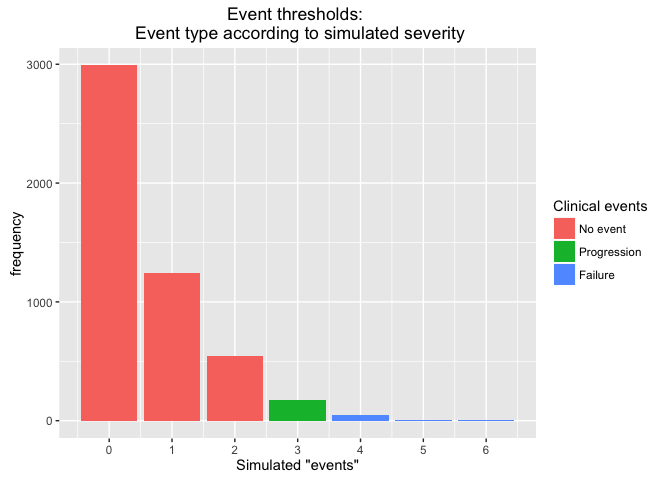
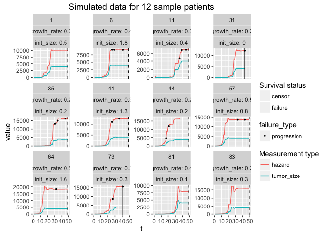
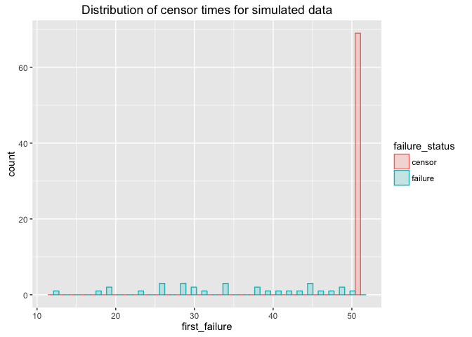

Test generative model using CmdStan
================
Jacqueline Buros
May 20, 2016

Intro
-----

This is a short analysis to test various options for estimating the "generative" model in Stan, and specifically using CmdStan.

There are several reasons why I'm looking at using CmdStan:

1.  Rstan is prone to fail/crash at some point, particularly for long-running jobs
    -   preliminary testing shows that these models will take a while to run

2.  Better diagnostics & more up to date codebase (e.g. support for stiff odes) with CmdStan
3.  Having problems running R on dev nodes (more about this later ... )

Simulated data
--------------

Data were simulated according to the `simulate_data()` function. See that function for more details.

Here we will use standard functions designed to help in post-processing of the simulated data.

``` r
set.seed(1234)
d <- simulate_data(n = 100, max_size = 4000, max_t = 50, failure_threshold = 4, progression_threshold = 3)
make_data_plots(d)
```

    ## Saving 7 x 5 in image

<!-- -->

    ## Saving 7 x 5 in image

<!-- -->

    ## `stat_bin()` using `bins = 30`. Pick better value with `binwidth`.
    ## Saving 7 x 5 in image

    ## `stat_bin()` using `bins = 30`. Pick better value with `binwidth`.

<!-- -->

We will next prepare two data files for analysis - one *per patient*, which will be suitable for survival analysis, and another *per observation*. This latter, *per-observation* dataset is the one we will predominantly pass to cmdstan.

``` r
res <- prep_data(d)
```

    ## Source: local data frame [3 x 4]
    ## 
    ##   failure_status failure_or_progression_status     n percent
    ##            (dbl)                         (dbl) (int)   (chr)
    ## 1              0                             0    33     33%
    ## 2              0                             1    36     36%
    ## 3              1                             1    31     31%

``` r
adata <- res$per_observation
survd <- res$per_patient
rm(res)
```

Standard models
---------------

Just for kicks, let's run a few standard models on this data.

We will focus on two covariates in particular -

1.  Initial tumor size (observed)
2.  Avg rate of change in tumor size: (final - initial) / time

We can look at these in terms of failure (survival), or the combintion of disease progression and/or failure.

#### with failure as the outcome

Looking at initial tumor size as a predictor :

``` r
survfit1 <- coxph(
  formula = Surv(first_failure, failure_status) ~ rescaled_init_size
  , data = survd
  )
print(survfit1)
```

    ## Call:
    ## coxph(formula = Surv(first_failure, failure_status) ~ rescaled_init_size, 
    ##     data = survd)
    ## 
    ## 
    ##                       coef exp(coef) se(coef)     z    p
    ## rescaled_init_size -0.0597    0.9421   0.1876 -0.32 0.75
    ## 
    ## Likelihood ratio test=0.1  on 1 df, p=0.75
    ## n= 100, number of events= 31

And, including change in tumor size :

``` r
survfit <- coxph(
  formula = Surv(first_failure, failure_status) ~ rescaled_init_size + rescaled_growth_rate
  , data = survd
  )
print(survfit)
```

    ## Call:
    ## coxph(formula = Surv(first_failure, failure_status) ~ rescaled_init_size + 
    ##     rescaled_growth_rate, data = survd)
    ## 
    ## 
    ##                       coef exp(coef) se(coef)    z       p
    ## rescaled_init_size   0.440     1.553    0.204 2.16   0.031
    ## rescaled_growth_rate 1.487     4.424    0.241 6.16 7.3e-10
    ## 
    ## Likelihood ratio test=43.4  on 2 df, p=3.83e-10
    ## n= 100, number of events= 31

#### with progression/failure as the outcome

Looking at initial tumor size as a predictor :

``` r
survfit <- coxph(
  formula = Surv(first_failure_or_progression, failure_or_progression_status) ~ rescaled_init_size
  , data = survd
  )
print(survfit)
```

    ## Call:
    ## coxph(formula = Surv(first_failure_or_progression, failure_or_progression_status) ~ 
    ##     rescaled_init_size, data = survd)
    ## 
    ## 
    ##                      coef exp(coef) se(coef)     z   p
    ## rescaled_init_size -0.208     0.812    0.128 -1.63 0.1
    ## 
    ## Likelihood ratio test=2.68  on 1 df, p=0.102
    ## n= 100, number of events= 67

And, including change in tumor size :

``` r
survfit <- coxph(
  formula = Surv(first_failure_or_progression, failure_or_progression_status) ~ rescaled_init_size + rescaled_growth_rate
  , data = survd
  )
print(survfit)
```

    ## Call:
    ## coxph(formula = Surv(first_failure_or_progression, failure_or_progression_status) ~ 
    ##     rescaled_init_size + rescaled_growth_rate, data = survd)
    ## 
    ## 
    ##                        coef exp(coef) se(coef)    z       p
    ## rescaled_init_size   0.0462    1.0473   0.1347 0.34    0.73
    ## rescaled_growth_rate 0.8077    2.2428   0.1392 5.80 6.5e-09
    ## 
    ## Likelihood ratio test=29.7  on 2 df, p=3.53e-07
    ## n= 100, number of events= 67

Stan code for basic survival model
----------------------------------

We have Stan code for the basic survival model. Let's run it now just to get a sense of how it works.

``` r
standata <- list(
  N = nrow(adata)
  , S = max(adata$patid)
  , T = max(adata$t)
  , X = 1
  , s = adata$patid
  , t = adata$t
  , event = adata$failure
  , covars = adata %>% dplyr::select(rescaled_init_size)
)

testfit <- stan(file.path(stanfile_dir,'long_surv.stan')
                , data = standata, chains = 1, iter = 10)
```

    ## 
    ## SAMPLING FOR MODEL 'long_surv' NOW (CHAIN 1).
    ## 
    ## Chain 1, Iteration: 1 / 10 [ 10%]  (Warmup)
    ## Chain 1, Iteration: 2 / 10 [ 20%]  (Warmup)
    ## Chain 1, Iteration: 3 / 10 [ 30%]  (Warmup)
    ## Chain 1, Iteration: 4 / 10 [ 40%]  (Warmup)
    ## Chain 1, Iteration: 5 / 10 [ 50%]  (Warmup)
    ## Chain 1, Iteration: 6 / 10 [ 60%]  (Sampling)
    ## Chain 1, Iteration: 7 / 10 [ 70%]  (Sampling)
    ## Chain 1, Iteration: 8 / 10 [ 80%]  (Sampling)
    ## Chain 1, Iteration: 9 / 10 [ 90%]  (Sampling)
    ## Chain 1, Iteration: 10 / 10 [100%]  (Sampling)# 
    ## #  Elapsed Time: 0.049914 seconds (Warm-up)
    ## #                0.033157 seconds (Sampling)
    ## #                0.083071 seconds (Total)
    ## #

    ## The following numerical problems occured the indicated number of times after warmup on chain 1

    ##                                                                                       count
    ## validate transformed params: hazard[1] is nan, but must be greater than or equal to 0     1

    ## When a numerical problem occurs, the Metropolis proposal gets rejected.

    ## However, by design Metropolis proposals sometimes get rejected even when there are no numerical problems.

    ## Thus, if the number in the 'count' column is small, do not ask about this message on stan-users.

``` r
stanfit <- stan(file.path(stanfile_dir,'long_surv.stan')
                , data = standata, chains = 3, iter = 1000)

print(stanfit, 'beta')
```

    ## Inference for Stan model: long_surv.
    ## 3 chains, each with iter=1000; warmup=500; thin=1; 
    ## post-warmup draws per chain=500, total post-warmup draws=1500.
    ## 
    ##          mean se_mean   sd 2.5%   25%   50%  75% 97.5% n_eff Rhat
    ## beta[1] -0.06       0 0.12 -0.3 -0.14 -0.06 0.01  0.15  1500    1
    ## 
    ## Samples were drawn using NUTS(diag_e) at Mon May 23 14:52:45 2016.
    ## For each parameter, n_eff is a crude measure of effective sample size,
    ## and Rhat is the potential scale reduction factor on split chains (at 
    ## convergence, Rhat=1).

Now, this is not *identical* to the survival analysis, but we should see very similar results to the estimates we got from `coxph`.

Let's confirm this now.

``` r
print(survfit1)
```

    ## Call:
    ## coxph(formula = Surv(first_failure, failure_status) ~ rescaled_init_size, 
    ##     data = survd)
    ## 
    ## 
    ##                       coef exp(coef) se(coef)     z    p
    ## rescaled_init_size -0.0597    0.9421   0.1876 -0.32 0.75
    ## 
    ## Likelihood ratio test=0.1  on 1 df, p=0.75
    ## n= 100, number of events= 31

Semi-competing risks model
--------------------------

We additionally have Stan code for a semi-competing risks model. This analysis will be summarized separately.

Generative model
----------------

We are finally working on what I'll call the "generative model" -- this is the model that more closely mimics the data generating process we hypothesized might be at work.

The code right now is making use of the `integrate_ode` function in Stan.

We will first review how this works & then test out the implementation using CmdStan.

### Ex 1: using stan to simulate data

Here is the stan file :

``` r
file_path <- file.path(stanfile_dir,'generative_model_sim_data.stan')
lines <- readLines(file_path, encoding="ASCII")
for (n in 1:length(lines)) cat(lines[n],'\n')
```

    ##  
    ## functions {  
    ##   /**  
    ##    * System State is represented by the current volume (TV) of the tumor  
    ##    *  
    ##    * The system has parameters  
    ##    *  
    ##    *   theta = (growth, max_size)  
    ##    *  
    ##    * where  
    ##    *  
    ##    *   growth:   inherent growth rate  
    ##    *   max_size: max tolerable size for the tumor (constant) 
    ##    *  
    ##    * The time derivative is  
    ##    *  
    ##    *   d.TV / d.t  =  (TV*growth*(max_size-TV)/max_size) 
    ##    *  
    ##    * @param t time at which derivative is evaluated.  
    ##    * @param TV tumor volume at time of evaluation. 
    ##    * @param theta parameters for system.  
    ##    * @param x_r real constants for system (stan defaults; empty).  
    ##    * @param x_i integer constants for system (stan defaults; empty).  
    ##    */  
    ##   real[] tumor_growth(real t, real[] y, real[] theta,  
    ##                            real[] x_r, int[] x_i) {  
    ##     real growth_rate; 
    ##     real max_size; 
    ##  
    ##     real dy_dt[1];  
    ##   
    ##     growth_rate <- theta[1];  
    ##     max_size <- theta[2];  
    ##  
    ##     dy_dt[1] <- y[1]*growth_rate*((max_size-y[1])/max_size);  
    ##      
    ##     return dy_dt;  
    ##   }  
    ##  
    ## } 
    ## data { 
    ##   // N obs to simulate 
    ##   int<lower=0> N_obs; 
    ##   real<lower=0> obs_t[N_obs]; // timepoint ids 
    ##   real<lower=0> init_vol; 
    ##   real<lower=0> growth_rate; 
    ##   real<lower=0> max_size; 
    ## } 
    ## transformed data {  
    ##   real x_r[0];                 // no real data for ODE system  
    ##   int x_i[0];                  // no integer data for ODE system  
    ##   real t0; 
    ##   t0 <- 0; 
    ## } 
    ## model { 
    ##    
    ## } 
    ## generated quantities { 
    ##   real tumor_vol[N_obs, 1];  // inferred tumor size 
    ##   real tumor_diam[N_obs, 1]; 
    ##   real theta[2]; 
    ##   real init_state[1]; 
    ##   theta[1] <- growth_rate; 
    ##   theta[2] <- max_size; 
    ##   init_state[1] <- init_vol; 
    ##    
    ##   tumor_vol <- integrate_ode(tumor_growth 
    ##                              , init_state 
    ##                              , t0 
    ##                              , obs_t 
    ##                              , theta 
    ##                              , x_r 
    ##                              , x_i 
    ##                              ); 
    ##   for (n in 1:N_obs) 
    ##     tumor_diam[n,1] <- 2*cbrt(tumor_vol[n,1] * (0.75) / pi()); 
    ## } 
    ## 

``` r
## pick a random patient; pass these parameters to the stan file 
sample_data <- adata %>% semi_join(adata %>% sample_n(1) %>% dplyr::select(patid), by = 'patid')

sample_params <- list(
  N_obs = nrow(sample_data)
  , obs_t = sample_data$t
  , init_vol = unique(sample_data$init_size)
  , growth_rate = unique(sample_data$growth_rate)
  , max_size = 4000
)
testfit <- stan(file.path(stanfile_dir,'generative_model_sim_data.stan')
                , data = sample_params, chains = 1, iter = 100
                , algorithm = 'Fixed_param')
```

    ## 
    ## SAMPLING FOR MODEL 'generative_model_sim_data' NOW (CHAIN 1).
    ## Warning: warmup will be skipped for the fixed parameter sampler!
    ## 
    ## Chain 1, Iteration:  1 / 100 [  1%]  (Sampling)
    ## Chain 1, Iteration: 10 / 100 [ 10%]  (Sampling)
    ## Chain 1, Iteration: 20 / 100 [ 20%]  (Sampling)
    ## Chain 1, Iteration: 30 / 100 [ 30%]  (Sampling)
    ## Chain 1, Iteration: 40 / 100 [ 40%]  (Sampling)
    ## Chain 1, Iteration: 50 / 100 [ 50%]  (Sampling)
    ## Chain 1, Iteration: 60 / 100 [ 60%]  (Sampling)
    ## Chain 1, Iteration: 70 / 100 [ 70%]  (Sampling)
    ## Chain 1, Iteration: 80 / 100 [ 80%]  (Sampling)
    ## Chain 1, Iteration: 90 / 100 [ 90%]  (Sampling)
    ## Chain 1, Iteration: 100 / 100 [100%]  (Sampling)# 
    ## #  Elapsed Time: 5e-06 seconds (Warm-up)
    ## #                0.007188 seconds (Sampling)
    ## #                0.007193 seconds (Total)
    ## #

``` r
print(testfit)
```

    ## Inference for Stan model: generative_model_sim_data.
    ## 1 chains, each with iter=100; warmup=50; thin=1; 
    ## post-warmup draws per chain=50, total post-warmup draws=50.
    ## 
    ##                     mean se_mean sd    2.5%     25%     50%     75%
    ## tumor_vol[1,1]      0.48       0  0    0.48    0.48    0.48    0.48
    ## tumor_vol[2,1]      0.70       0  0    0.70    0.70    0.70    0.70
    ## tumor_vol[3,1]      1.02       0  0    1.02    1.02    1.02    1.02
    ## tumor_vol[4,1]      1.49       0  0    1.49    1.49    1.49    1.49
    ## tumor_vol[5,1]      2.17       0  0    2.17    2.17    2.17    2.17
    ## tumor_vol[6,1]      3.16       0  0    3.16    3.16    3.16    3.16
    ## tumor_vol[7,1]      4.61       0  0    4.61    4.61    4.61    4.61
    ## tumor_vol[8,1]      6.71       0  0    6.71    6.71    6.71    6.71
    ## tumor_vol[9,1]      9.78       0  0    9.78    9.78    9.78    9.78
    ## tumor_vol[10,1]    14.24       0  0   14.24   14.24   14.24   14.24
    ## tumor_vol[11,1]    20.72       0  0   20.72   20.72   20.72   20.72
    ## tumor_vol[12,1]    30.12       0  0   30.12   30.12   30.12   30.12
    ## tumor_vol[13,1]    43.76       0  0   43.76   43.76   43.76   43.76
    ## tumor_vol[14,1]    63.47       0  0   63.47   63.47   63.47   63.47
    ## tumor_vol[15,1]    91.84       0  0   91.84   91.84   91.84   91.84
    ## tumor_vol[16,1]   132.48       0  0  132.48  132.48  132.48  132.48
    ## tumor_vol[17,1]   190.21       0  0  190.21  190.21  190.21  190.21
    ## tumor_vol[18,1]   271.35       0  0  271.35  271.35  271.35  271.35
    ## tumor_vol[19,1]   383.61       0  0  383.61  383.61  383.61  383.61
    ## tumor_vol[20,1]   535.65       0  0  535.65  535.65  535.65  535.65
    ## tumor_vol[21,1]   735.68       0  0  735.68  735.68  735.68  735.68
    ## tumor_vol[22,1]   989.08       0  0  989.08  989.08  989.08  989.08
    ## tumor_vol[23,1]  1295.14       0  0 1295.14 1295.14 1295.14 1295.14
    ## tumor_vol[24,1]  1644.19       0  0 1644.19 1644.19 1644.19 1644.19
    ## tumor_vol[25,1]  2017.15       0  0 2017.15 2017.15 2017.15 2017.15
    ## tumor_vol[26,1]  2388.92       0  0 2388.92 2388.92 2388.92 2388.92
    ## tumor_vol[27,1]  2734.72       0  0 2734.72 2734.72 2734.72 2734.72
    ## tumor_vol[28,1]  3036.23       0  0 3036.23 3036.23 3036.23 3036.23
    ## tumor_vol[29,1]  3284.69       0  0 3284.69 3284.69 3284.69 3284.69
    ## tumor_vol[30,1]  3480.07       0  0 3480.07 3480.07 3480.07 3480.07
    ## tumor_vol[31,1]  3628.12       0  0 3628.12 3628.12 3628.12 3628.12
    ## tumor_vol[32,1]  3737.20       0  0 3737.20 3737.20 3737.20 3737.20
    ## tumor_vol[33,1]  3815.91       0  0 3815.91 3815.91 3815.91 3815.91
    ## tumor_vol[34,1]  3871.85       0  0 3871.85 3871.85 3871.85 3871.85
    ## tumor_vol[35,1]  3911.19       0  0 3911.19 3911.19 3911.19 3911.19
    ## tumor_vol[36,1]  3938.64       0  0 3938.64 3938.64 3938.64 3938.64
    ## tumor_vol[37,1]  3957.70       0  0 3957.70 3957.70 3957.70 3957.70
    ## tumor_vol[38,1]  3970.88       0  0 3970.88 3970.88 3970.88 3970.88
    ## tumor_vol[39,1]  3979.98       0  0 3979.98 3979.98 3979.98 3979.98
    ## tumor_vol[40,1]  3986.24       0  0 3986.24 3986.24 3986.24 3986.24
    ## tumor_vol[41,1]  3990.55       0  0 3990.55 3990.55 3990.55 3990.55
    ## tumor_vol[42,1]  3993.51       0  0 3993.51 3993.51 3993.51 3993.51
    ## tumor_vol[43,1]  3995.55       0  0 3995.55 3995.55 3995.55 3995.55
    ## tumor_vol[44,1]  3996.94       0  0 3996.94 3996.94 3996.94 3996.94
    ## tumor_vol[45,1]  3997.90       0  0 3997.90 3997.90 3997.90 3997.90
    ## tumor_vol[46,1]  3998.56       0  0 3998.56 3998.56 3998.56 3998.56
    ## tumor_vol[47,1]  3999.01       0  0 3999.01 3999.01 3999.01 3999.01
    ## tumor_vol[48,1]  3999.32       0  0 3999.32 3999.32 3999.32 3999.32
    ## tumor_vol[49,1]  3999.53       0  0 3999.53 3999.53 3999.53 3999.53
    ## tumor_diam[1,1]     0.97       0  0    0.97    0.97    0.97    0.97
    ## tumor_diam[2,1]     1.10       0  0    1.10    1.10    1.10    1.10
    ## tumor_diam[3,1]     1.25       0  0    1.25    1.25    1.25    1.25
    ## tumor_diam[4,1]     1.42       0  0    1.42    1.42    1.42    1.42
    ## tumor_diam[5,1]     1.61       0  0    1.61    1.61    1.61    1.61
    ## tumor_diam[6,1]     1.82       0  0    1.82    1.82    1.82    1.82
    ## tumor_diam[7,1]     2.06       0  0    2.06    2.06    2.06    2.06
    ## tumor_diam[8,1]     2.34       0  0    2.34    2.34    2.34    2.34
    ## tumor_diam[9,1]     2.65       0  0    2.65    2.65    2.65    2.65
    ## tumor_diam[10,1]    3.01       0  0    3.01    3.01    3.01    3.01
    ## tumor_diam[11,1]    3.41       0  0    3.41    3.41    3.41    3.41
    ## tumor_diam[12,1]    3.86       0  0    3.86    3.86    3.86    3.86
    ## tumor_diam[13,1]    4.37       0  0    4.37    4.37    4.37    4.37
    ## tumor_diam[14,1]    4.95       0  0    4.95    4.95    4.95    4.95
    ## tumor_diam[15,1]    5.60       0  0    5.60    5.60    5.60    5.60
    ## tumor_diam[16,1]    6.32       0  0    6.32    6.32    6.32    6.32
    ## tumor_diam[17,1]    7.14       0  0    7.14    7.14    7.14    7.14
    ## tumor_diam[18,1]    8.03       0  0    8.03    8.03    8.03    8.03
    ## tumor_diam[19,1]    9.01       0  0    9.01    9.01    9.01    9.01
    ## tumor_diam[20,1]   10.08       0  0   10.08   10.08   10.08   10.08
    ## tumor_diam[21,1]   11.20       0  0   11.20   11.20   11.20   11.20
    ## tumor_diam[22,1]   12.36       0  0   12.36   12.36   12.36   12.36
    ## tumor_diam[23,1]   13.52       0  0   13.52   13.52   13.52   13.52
    ## tumor_diam[24,1]   14.64       0  0   14.64   14.64   14.64   14.64
    ## tumor_diam[25,1]   15.68       0  0   15.68   15.68   15.68   15.68
    ## tumor_diam[26,1]   16.59       0  0   16.59   16.59   16.59   16.59
    ## tumor_diam[27,1]   17.35       0  0   17.35   17.35   17.35   17.35
    ## tumor_diam[28,1]   17.97       0  0   17.97   17.97   17.97   17.97
    ## tumor_diam[29,1]   18.44       0  0   18.44   18.44   18.44   18.44
    ## tumor_diam[30,1]   18.80       0  0   18.80   18.80   18.80   18.80
    ## tumor_diam[31,1]   19.06       0  0   19.06   19.06   19.06   19.06
    ## tumor_diam[32,1]   19.25       0  0   19.25   19.25   19.25   19.25
    ## tumor_diam[33,1]   19.39       0  0   19.39   19.39   19.39   19.39
    ## tumor_diam[34,1]   19.48       0  0   19.48   19.48   19.48   19.48
    ## tumor_diam[35,1]   19.55       0  0   19.55   19.55   19.55   19.55
    ## tumor_diam[36,1]   19.59       0  0   19.59   19.59   19.59   19.59
    ## tumor_diam[37,1]   19.63       0  0   19.63   19.63   19.63   19.63
    ## tumor_diam[38,1]   19.65       0  0   19.65   19.65   19.65   19.65
    ## tumor_diam[39,1]   19.66       0  0   19.66   19.66   19.66   19.66
    ## tumor_diam[40,1]   19.67       0  0   19.67   19.67   19.67   19.67
    ## tumor_diam[41,1]   19.68       0  0   19.68   19.68   19.68   19.68
    ## tumor_diam[42,1]   19.68       0  0   19.68   19.68   19.68   19.68
    ## tumor_diam[43,1]   19.69       0  0   19.69   19.69   19.69   19.69
    ## tumor_diam[44,1]   19.69       0  0   19.69   19.69   19.69   19.69
    ## tumor_diam[45,1]   19.69       0  0   19.69   19.69   19.69   19.69
    ## tumor_diam[46,1]   19.69       0  0   19.69   19.69   19.69   19.69
    ## tumor_diam[47,1]   19.69       0  0   19.69   19.69   19.69   19.69
    ## tumor_diam[48,1]   19.69       0  0   19.69   19.69   19.69   19.69
    ## tumor_diam[49,1]   19.69       0  0   19.69   19.69   19.69   19.69
    ## theta[1]            0.38       0  0    0.38    0.38    0.38    0.38
    ## theta[2]         4000.00       0  0 4000.00 4000.00 4000.00 4000.00
    ## init_state[1]       0.33       0  0    0.33    0.33    0.33    0.33
    ## lp__                0.00       0  0    0.00    0.00    0.00    0.00
    ##                    97.5% n_eff Rhat
    ## tumor_vol[1,1]      0.48    50  NaN
    ## tumor_vol[2,1]      0.70    50 0.98
    ## tumor_vol[3,1]      1.02     1 0.98
    ## tumor_vol[4,1]      1.49     1 0.98
    ## tumor_vol[5,1]      2.17     1  NaN
    ## tumor_vol[6,1]      3.16     1 0.98
    ## tumor_vol[7,1]      4.61     1 0.98
    ## tumor_vol[8,1]      6.71    50  NaN
    ## tumor_vol[9,1]      9.78     1 0.98
    ## tumor_vol[10,1]    14.24     1  NaN
    ## tumor_vol[11,1]    20.72     1 0.98
    ## tumor_vol[12,1]    30.12     1 0.98
    ## tumor_vol[13,1]    43.76     1 0.98
    ## tumor_vol[14,1]    63.47     1 0.98
    ## tumor_vol[15,1]    91.84     1 0.98
    ## tumor_vol[16,1]   132.48     1 0.98
    ## tumor_vol[17,1]   190.21     1  NaN
    ## tumor_vol[18,1]   271.35     1 0.98
    ## tumor_vol[19,1]   383.61     1 0.98
    ## tumor_vol[20,1]   535.65     1 0.98
    ## tumor_vol[21,1]   735.68     1  NaN
    ## tumor_vol[22,1]   989.08     1 0.98
    ## tumor_vol[23,1]  1295.14     1 0.98
    ## tumor_vol[24,1]  1644.19     1 0.98
    ## tumor_vol[25,1]  2017.15     1 0.98
    ## tumor_vol[26,1]  2388.92     1 0.98
    ## tumor_vol[27,1]  2734.72     1 0.98
    ## tumor_vol[28,1]  3036.23     1  NaN
    ## tumor_vol[29,1]  3284.69     1 0.98
    ## tumor_vol[30,1]  3480.07     1 0.98
    ## tumor_vol[31,1]  3628.12    50 0.98
    ## tumor_vol[32,1]  3737.20     1 0.98
    ## tumor_vol[33,1]  3815.91     1 0.98
    ## tumor_vol[34,1]  3871.85    50  NaN
    ## tumor_vol[35,1]  3911.19     1 0.98
    ## tumor_vol[36,1]  3938.64     1 0.98
    ## tumor_vol[37,1]  3957.70     1 0.98
    ## tumor_vol[38,1]  3970.88     1 0.98
    ## tumor_vol[39,1]  3979.98     1 0.98
    ## tumor_vol[40,1]  3986.24     1 0.98
    ## tumor_vol[41,1]  3990.55     1 0.98
    ## tumor_vol[42,1]  3993.51     1 0.98
    ## tumor_vol[43,1]  3995.55     1 0.98
    ## tumor_vol[44,1]  3996.94     1 0.98
    ## tumor_vol[45,1]  3997.90     1 0.98
    ## tumor_vol[46,1]  3998.56     1 0.98
    ## tumor_vol[47,1]  3999.01     1 0.98
    ## tumor_vol[48,1]  3999.32     1 0.98
    ## tumor_vol[49,1]  3999.53     1 0.98
    ## tumor_diam[1,1]     0.97     1 0.98
    ## tumor_diam[2,1]     1.10     1 0.98
    ## tumor_diam[3,1]     1.25     1 0.98
    ## tumor_diam[4,1]     1.42     1 0.98
    ## tumor_diam[5,1]     1.61     1 0.98
    ## tumor_diam[6,1]     1.82     1 0.98
    ## tumor_diam[7,1]     2.06     1 0.98
    ## tumor_diam[8,1]     2.34     1 0.98
    ## tumor_diam[9,1]     2.65    50  NaN
    ## tumor_diam[10,1]    3.01     1 0.98
    ## tumor_diam[11,1]    3.41     1  NaN
    ## tumor_diam[12,1]    3.86     1 0.98
    ## tumor_diam[13,1]    4.37     1 0.98
    ## tumor_diam[14,1]    4.95     1 0.98
    ## tumor_diam[15,1]    5.60     1 0.98
    ## tumor_diam[16,1]    6.32     1 0.98
    ## tumor_diam[17,1]    7.14    50  NaN
    ## tumor_diam[18,1]    8.03     1 0.98
    ## tumor_diam[19,1]    9.01     1  NaN
    ## tumor_diam[20,1]   10.08     1 0.98
    ## tumor_diam[21,1]   11.20     1 0.98
    ## tumor_diam[22,1]   12.36     1 0.98
    ## tumor_diam[23,1]   13.52     1 0.98
    ## tumor_diam[24,1]   14.64     1 0.98
    ## tumor_diam[25,1]   15.68    50  NaN
    ## tumor_diam[26,1]   16.59     1  NaN
    ## tumor_diam[27,1]   17.35     1 0.98
    ## tumor_diam[28,1]   17.97     1 0.98
    ## tumor_diam[29,1]   18.44     1 0.98
    ## tumor_diam[30,1]   18.80     1 0.98
    ## tumor_diam[31,1]   19.06     1 0.98
    ## tumor_diam[32,1]   19.25     1 0.98
    ## tumor_diam[33,1]   19.39     1 0.98
    ## tumor_diam[34,1]   19.48     1 0.98
    ## tumor_diam[35,1]   19.55     1 0.98
    ## tumor_diam[36,1]   19.59     1 0.98
    ## tumor_diam[37,1]   19.63     1 0.98
    ## tumor_diam[38,1]   19.65     1 0.98
    ## tumor_diam[39,1]   19.66     1  NaN
    ## tumor_diam[40,1]   19.67     1 0.98
    ## tumor_diam[41,1]   19.68     1 0.98
    ## tumor_diam[42,1]   19.68     1 0.98
    ## tumor_diam[43,1]   19.69     1 0.98
    ## tumor_diam[44,1]   19.69     1 0.98
    ## tumor_diam[45,1]   19.69     1 0.98
    ## tumor_diam[46,1]   19.69     1 0.98
    ## tumor_diam[47,1]   19.69     1 0.98
    ## tumor_diam[48,1]   19.69     1 0.98
    ## tumor_diam[49,1]   19.69     1 0.98
    ## theta[1]            0.38     1 0.98
    ## theta[2]         4000.00    50  NaN
    ## init_state[1]       0.33     1 0.98
    ## lp__                0.00    50  NaN
    ## 
    ## Samples were drawn using (diag_e) at Mon May 23 14:52:51 2016.
    ## For each parameter, n_eff is a crude measure of effective sample size,
    ## and Rhat is the potential scale reduction factor on split chains (at 
    ## convergence, Rhat=1).

### Ex 2: estimating parameters for a single patient

Next we want to try to use `Stan` to estimate the growth rate for a single patient's tumor.

We will try to set this up as a "best case" scenario, where we will tell Stan what the max-size is, and we will also estimate this using actual *tumor size* measurements, instead of the diameter measurements (with measurement error) that were simulated.

Here is the stan file we'll be using to estimate this:

``` r
file_path <- file.path(stanfile_dir,'generative_model_single_obs_more_params.stan')
lines <- readLines(file_path, encoding="ASCII")
for (n in 1:length(lines)) cat(lines[n],'\n')
```

    ##  
    ## /*  notes about input data &/or the model 
    ##  
    ##  N_obs        = int; number of measurement occasions (length of data) 
    ##  obs_t        = int; timepoint (id) for each measurement occasion 
    ##  obs_size     = real; tumor measurement at time t (use 0 when no measurement) 
    ##  
    ## */ 
    ## // Jacqueline Buros Novik <jackinovik@gmail.com> 
    ##  
    ## functions {  
    ##   /**  
    ##    * System State is represented by the current volume (TV) of the tumor  
    ##    *  
    ##    * The system has parameters  
    ##    *  
    ##    *   theta = (growth, max_size)  
    ##    *  
    ##    * where  
    ##    *  
    ##    *   growth:   inherent growth rate  
    ##    *   max_size: max tolerable size for the tumor (constant) 
    ##    *  
    ##    * The time derivative is  
    ##    *  
    ##    *   d.TV / d.t  =  (TV*growth*(max_size-TV)/max_size) 
    ##    *  
    ##    * @param t time at which derivative is evaluated.  
    ##    * @param TV tumor volume at time of evaluation. 
    ##    * @param theta parameters for system.  
    ##    * @param x_r real constants for system (stan defaults; empty).  
    ##    * @param x_i integer constants for system (stan defaults; empty).  
    ##    */  
    ##   real[] tumor_growth(real t, real[] TV, real[] theta,  
    ##                            real[] x_r, int[] x_i) {  
    ##     real growth_rate; 
    ##     real max_size; 
    ##  
    ##     real dTV_dt[1];  
    ##   
    ##     growth_rate <- theta[1];  
    ##     max_size <- theta[2];  
    ##  
    ##     dTV_dt[1] <- (TV[1]*growth_rate*(1-TV[1]/max_size));  
    ##      
    ##     return dTV_dt;  
    ##   }  
    ##  
    ## } 
    ## data { 
    ##   int<lower=0> N_obs; 
    ##   real<lower=0> obs_t[N_obs]; // timepoint ids 
    ##   real<lower=0> obs_size[N_obs]; 
    ##   real<lower=0> max_size; 
    ## } 
    ## transformed data {  
    ##   real x_r[0];                 // no real data for ODE system  
    ##   int x_i[0];                  // no integer data for ODE system  
    ##   int t0; 
    ##   t0 <- 0; 
    ## } 
    ## parameters { 
    ## //  real<lower=0> max_size_raw;        // max tolerable size for each tumor 
    ##   real<lower=0> growth_rate;         // rate of growth 
    ##   real<lower=0> meas_error;          // global measurement error of diameters 
    ##   real<lower=0> init_vol;            // estimated initial volume 
    ## } 
    ## transformed parameters { 
    ##   real tumor_vol[N_obs, 1];  // inferred tumor size 
    ##   real theta[2]; 
    ##   real init_state[1]; 
    ## //  real max_size; 
    ## //  max_size <- 4000 + max_size_raw; 
    ##   theta[1] <- growth_rate; 
    ##   theta[2] <- max_size; 
    ##   init_state[1] <- init_vol; 
    ##    
    ##    
    ##   tumor_vol <- integrate_ode(tumor_growth 
    ##                              , init_state 
    ##                              , t0 
    ##                              , obs_t 
    ##                              , theta 
    ##                              , x_r 
    ##                              , x_i 
    ##                              ); 
    ## } 
    ## model { 
    ##   meas_error ~ cauchy(0, 1); 
    ##   init_vol ~ normal(0, 1); 
    ##   growth_rate ~ normal(0, 1); 
    ##   //max_size_raw ~ normal(0, 10); 
    ##   for (n in 1:N_obs) 
    ##     obs_size[n] ~ normal(tumor_vol[n,1], meas_error); 
    ## }

#### invoking CmdStan

The process for invoking this from CmdStan involves a few steps :

1.  Write out data to file
2.  Call "make" to translate *.stan -&gt; *.cpp -&gt; executable
3.  invoke executable on the data file, with params (possibly multiple chains)

Written in R code, this looks like :

``` r
## prep data for stan
growthdata <- list(
  N_obs = nrow(sample_data)
  , obs_t = sample_data$t
  , obs_size = sample_data$tumor_size
  , max_size = 4000
)
## call using cmdstan instead of rstan. more reliable for longer-running models
stan_home <- '/usr/local/Cellar/cmdstan/2.9.0'
modelpath <- file.path(stanfile_dir,'generative_model_single_obs_more_params.stan')
modelpath <- gsub(modelpath, pattern = "(.*)\\.stan", replacement = '\\1')
modelname <- gsub(modelpath, pattern = ".*\\/([^\\/.]+)$", replacement = "\\1")
datafile <- file.path(getwd(),paste0(modelname,'.data.R'))
## write data to disk
with(growthdata, stan_rdump(names(growthdata), file = datafile))
## translate stan -> c++; compile to executable
system(paste0('(cd ',stan_home,' && make ',modelpath,')'))
## test on 10 iterations

system(paste0('./',modelname,' diagnose data file=',datafile))
system(paste0('./',modelname,' sample num_samples=5 num_warmup=5 random seed=12345 data file=',datafile))
```

#### invoking rstan

``` r
growthdata <- list(
  N_obs = nrow(sample_data)
  , obs_t = sample_data$t
  , obs_size = sample_data$tumor_size
  , max_size = 4000
)
testfit <- stan(file.path(stanfile_dir,'generative_model_single_obs_more_params.stan')
                , data = growthdata, iter=10, chains = 1)
```
