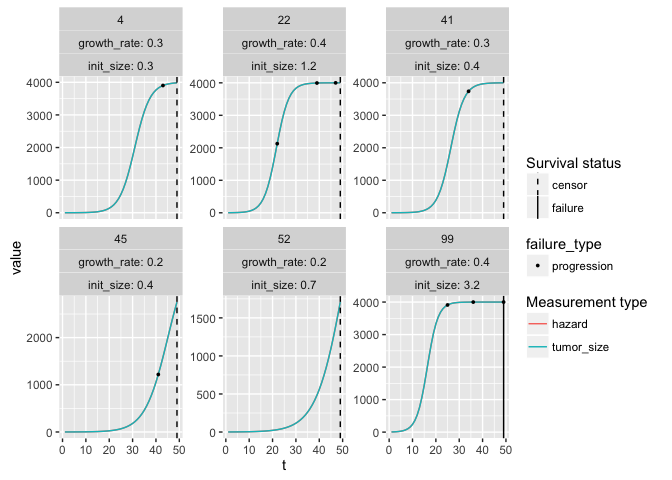
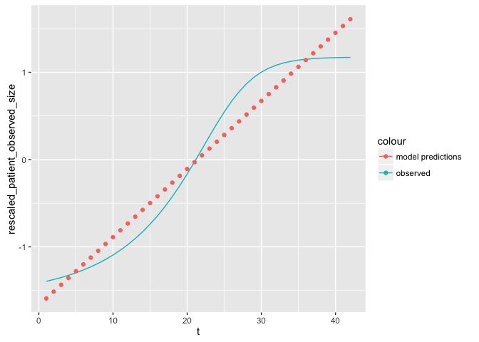
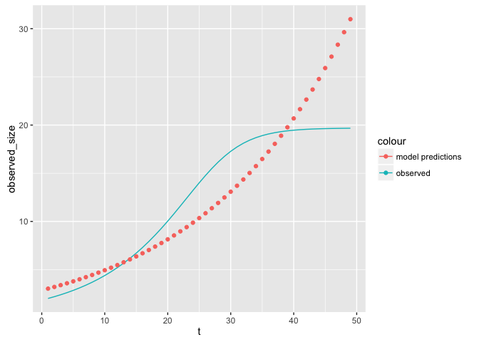
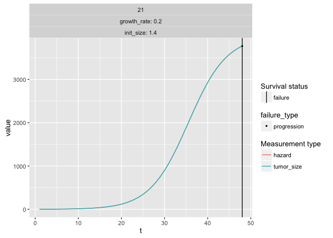
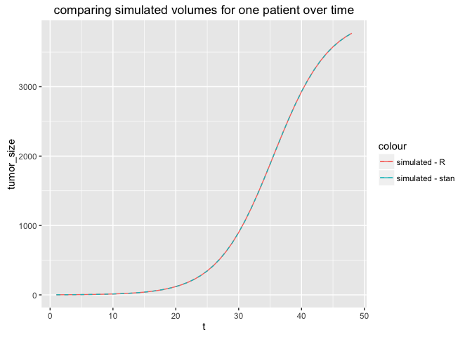

Test-growth-model.Rmd
================
Jacqueline Buros
May 23, 2016

Simulate data
-------------

Simulate data using standard functions.

Changes from previous versions: 1. remove all sources of noise 2. make hazard directly proportional to size of tumor

``` r
data <- simulate_data(n = 100
                      , max_size = 4000
                      , max_t = 50
                      , failure_threshold = 4
                      , progression_threshold = 3
                      , size_noise_fun = create_scalar(0)
                      , growth_rate_noise_fun = create_scalar(0)
                      , hazard_noise_fun = create_scalar(0)
                      , hazard_fun = function(row) {row$tumor_size} ## for now, hazard proportional to size
                      )

## prep data for analysis
res <- prep_data(data) 
```

    ## Source: local data frame [3 x 4]
    ## 
    ##   failure_status failure_or_progression_status     n percent
    ##            (dbl)                         (dbl) (int)   (chr)
    ## 1              0                             0    23     23%
    ## 2              0                             1    43     43%
    ## 3              1                             1    34     34%

``` r
survd <- res$per_patient ## summarized per patient; appropriate for typical survival analysis
adata <- res$per_observation ## denormalized; appropriate for longitudinal analysis
rm(res)

## review data for a few simulated points
plot_simulated_data(data, n = 6)
```

<!-- -->

Test growth model using lme4 / lmer
-----------------------------------

``` r
growthfit <- lmer(rescaled_patient_observed_size ~ t + rescaled_init_size + 
                    (1 + t || patid)
                  , data = adata
                  )
display(growthfit)        
```

    ## lmer(formula = rescaled_patient_observed_size ~ t + rescaled_init_size + 
    ##     ((1 | patid) + (0 + t | patid)), data = adata)
    ##                    coef.est coef.se
    ## (Intercept)        -1.67     0.01  
    ## t                   0.07     0.00  
    ## rescaled_init_size  0.01     0.01  
    ## 
    ## Error terms:
    ##  Groups   Name        Std.Dev.
    ##  patid    (Intercept) 0.00    
    ##  patid.1  t           0.02    
    ##  Residual             0.30    
    ## ---
    ## number of obs: 4553, groups: patid, 100
    ## AIC = 2418.9, DIC = 2355
    ## deviance = 2381.0

How well does this fit?

``` r
adata$pd <- predict(growthfit)
ggplot(adata %>% semi_join(adata %>% sample_n(1), by = 'patid')
       , aes(x = t, group = patid)
       ) +
  geom_line(aes(y = rescaled_patient_observed_size, colour = 'observed')) + 
  geom_point(aes(y = pd, colour = 'model predictions'))
```

<!-- -->

Need to transform data, since we are modeling a % growth rate

``` r
growthfit2 <- lmer(log1p(observed_size) ~ t + rescaled_init_size + 
                    (1 + t || patid)
                  , data = adata
)
display(growthfit2)
```

    ## lmer(formula = log1p(observed_size) ~ t + rescaled_init_size + 
    ##     ((1 | patid) + (0 + t | patid)), data = adata)
    ##                    coef.est coef.se
    ## (Intercept)        1.04     0.02   
    ## t                  0.05     0.00   
    ## rescaled_init_size 0.23     0.02   
    ## 
    ## Error terms:
    ##  Groups   Name        Std.Dev.
    ##  patid    (Intercept) 0.22    
    ##  patid.1  t           0.01    
    ##  Residual             0.25    
    ## ---
    ## number of obs: 4553, groups: patid, 100
    ## AIC = 948.2, DIC = 889.9
    ## deviance = 913.1

See if fit improves

``` r
adata$pd2 <- expm1(predict(growthfit2))
ggplot(adata %>% semi_join(adata %>% sample_n(1), by = 'patid')
       , aes(x = t, group = patid)
) +
  geom_line(aes(y = observed_size, colour = 'observed')) + 
  geom_point(aes(y = pd2, colour = 'model predictions'))
```

<!-- -->

Checking Stan code by using it to simulate data
-----------------------------------------------

First thing we're going to do is double-check the Stan code by using it to simulate the data for one patient. The data simulated using Stan should match that simulated using R exactly.

``` r
## pick random patient
sample_data <- adata %>% semi_join(adata %>% sample_n(1) %>% dplyr::select(patid), by = 'patid')
plot_simulated_data(sample_data, n = NULL)
```

<!-- -->

``` r
## what does simulated data look like according to these params?
## make sure data simulated according to R match those according to Stan
sample_params <- list(
  N_obs = nrow(sample_data)
  , obs_t = sample_data$t
  , init_vol = unique(sample_data$init_size)
  , growth_rate = unique(sample_data$growth_rate)
  , max_size = 4000
)
stangen <- stan(file.path(stanfile_dir,'generative_model_sim_data.stan')
                , data = sample_params, chains = 1, iter = 5, algorithm = 'Fixed_param')
```

    ## 
    ## SAMPLING FOR MODEL 'generative_model_sim_data' NOW (CHAIN 1).
    ## Warning: warmup will be skipped for the fixed parameter sampler!
    ## 
    ## Chain 1, Iteration: 1 / 5 [ 20%]  (Sampling)
    ## Chain 1, Iteration: 2 / 5 [ 40%]  (Sampling)
    ## Chain 1, Iteration: 3 / 5 [ 60%]  (Sampling)
    ## Chain 1, Iteration: 4 / 5 [ 80%]  (Sampling)
    ## Chain 1, Iteration: 5 / 5 [100%]  (Sampling)# 
    ## #  Elapsed Time: 6e-06 seconds (Warm-up)
    ## #                0.000353 seconds (Sampling)
    ## #                0.000359 seconds (Total)
    ## #

``` r
print(stangen, pars = 'tumor_vol')
```

    ## Inference for Stan model: generative_model_sim_data.
    ## 1 chains, each with iter=5; warmup=2; thin=1; 
    ## post-warmup draws per chain=3, total post-warmup draws=3.
    ## 
    ##                    mean se_mean sd    2.5%     25%     50%     75%   97.5%
    ## tumor_vol[1,1]     1.73       0  0    1.73    1.73    1.73    1.73    1.73
    ## tumor_vol[2,1]     2.17       0  0    2.17    2.17    2.17    2.17    2.17
    ## tumor_vol[3,1]     2.71       0  0    2.71    2.71    2.71    2.71    2.71
    ## tumor_vol[4,1]     3.39       0  0    3.39    3.39    3.39    3.39    3.39
    ## tumor_vol[5,1]     4.25       0  0    4.25    4.25    4.25    4.25    4.25
    ## tumor_vol[6,1]     5.31       0  0    5.31    5.31    5.31    5.31    5.31
    ## tumor_vol[7,1]     6.65       0  0    6.65    6.65    6.65    6.65    6.65
    ## tumor_vol[8,1]     8.32       0  0    8.32    8.32    8.32    8.32    8.32
    ## tumor_vol[9,1]    10.40       0  0   10.40   10.40   10.40   10.40   10.40
    ## tumor_vol[10,1]   13.01       0  0   13.01   13.01   13.01   13.01   13.01
    ## tumor_vol[11,1]   16.27       0  0   16.27   16.27   16.27   16.27   16.27
    ## tumor_vol[12,1]   20.35       0  0   20.35   20.35   20.35   20.35   20.35
    ## tumor_vol[13,1]   25.43       0  0   25.43   25.43   25.43   25.43   25.43
    ## tumor_vol[14,1]   31.78       0  0   31.78   31.78   31.78   31.78   31.78
    ## tumor_vol[15,1]   39.69       0  0   39.69   39.69   39.69   39.69   39.69
    ## tumor_vol[16,1]   49.56       0  0   49.56   49.56   49.56   49.56   49.56
    ## tumor_vol[17,1]   61.83       0  0   61.83   61.83   61.83   61.83   61.83
    ## tumor_vol[18,1]   77.08       0  0   77.08   77.08   77.08   77.08   77.08
    ## tumor_vol[19,1]   96.01       0  0   96.01   96.01   96.01   96.01   96.01
    ## tumor_vol[20,1]  119.44       0  0  119.44  119.44  119.44  119.44  119.44
    ## tumor_vol[21,1]  148.37       0  0  148.37  148.37  148.37  148.37  148.37
    ## tumor_vol[22,1]  183.98       0  0  183.98  183.98  183.98  183.98  183.98
    ## tumor_vol[23,1]  227.63       0  0  227.63  227.63  227.63  227.63  227.63
    ## tumor_vol[24,1]  280.88       0  0  280.88  280.88  280.88  280.88  280.88
    ## tumor_vol[25,1]  345.43       0  0  345.43  345.43  345.43  345.43  345.43
    ## tumor_vol[26,1]  423.14       0  0  423.14  423.14  423.14  423.14  423.14
    ## tumor_vol[27,1]  515.86       0  0  515.86  515.86  515.86  515.86  515.86
    ## tumor_vol[28,1]  625.34       0  0  625.34  625.34  625.34  625.34  625.34
    ## tumor_vol[29,1]  753.04       0  0  753.04  753.04  753.04  753.04  753.04
    ## tumor_vol[30,1]  899.87       0  0  899.87  899.87  899.87  899.87  899.87
    ## tumor_vol[31,1] 1065.92       0  0 1065.92 1065.92 1065.92 1065.92 1065.92
    ## tumor_vol[32,1] 1250.25       0  0 1250.25 1250.25 1250.25 1250.25 1250.25
    ## tumor_vol[33,1] 1450.70       0  0 1450.70 1450.70 1450.70 1450.70 1450.70
    ## tumor_vol[34,1] 1663.85       0  0 1663.85 1663.85 1663.85 1663.85 1663.85
    ## tumor_vol[35,1] 1885.15       0  0 1885.15 1885.15 1885.15 1885.15 1885.15
    ## tumor_vol[36,1] 2109.31       0  0 2109.31 2109.31 2109.31 2109.31 2109.31
    ## tumor_vol[37,1] 2330.74       0  0 2330.74 2330.74 2330.74 2330.74 2330.74
    ## tumor_vol[38,1] 2544.15       0  0 2544.15 2544.15 2544.15 2544.15 2544.15
    ## tumor_vol[39,1] 2744.96       0  0 2744.96 2744.96 2744.96 2744.96 2744.96
    ## tumor_vol[40,1] 2929.73       0  0 2929.73 2929.73 2929.73 2929.73 2929.73
    ## tumor_vol[41,1] 3096.25       0  0 3096.25 3096.25 3096.25 3096.25 3096.25
    ## tumor_vol[42,1] 3243.55       0  0 3243.55 3243.55 3243.55 3243.55 3243.55
    ## tumor_vol[43,1] 3371.71       0  0 3371.71 3371.71 3371.71 3371.71 3371.71
    ## tumor_vol[44,1] 3481.63       0  0 3481.63 3481.63 3481.63 3481.63 3481.63
    ## tumor_vol[45,1] 3574.75       0  0 3574.75 3574.75 3574.75 3574.75 3574.75
    ## tumor_vol[46,1] 3652.80       0  0 3652.80 3652.80 3652.80 3652.80 3652.80
    ## tumor_vol[47,1] 3717.67       0  0 3717.67 3717.67 3717.67 3717.67 3717.67
    ## tumor_vol[48,1] 3771.17       0  0 3771.17 3771.17 3771.17 3771.17 3771.17
    ##                 n_eff Rhat
    ## tumor_vol[1,1]      1  NaN
    ## tumor_vol[2,1]      3  NaN
    ## tumor_vol[3,1]      3  NaN
    ## tumor_vol[4,1]      3  NaN
    ## tumor_vol[5,1]      3  NaN
    ## tumor_vol[6,1]      3  NaN
    ## tumor_vol[7,1]      3  NaN
    ## tumor_vol[8,1]      3  NaN
    ## tumor_vol[9,1]      3  NaN
    ## tumor_vol[10,1]     3  NaN
    ## tumor_vol[11,1]     3  NaN
    ## tumor_vol[12,1]     3  NaN
    ## tumor_vol[13,1]     3  NaN
    ## tumor_vol[14,1]     3  NaN
    ## tumor_vol[15,1]     3  NaN
    ## tumor_vol[16,1]     3  NaN
    ## tumor_vol[17,1]     3  NaN
    ## tumor_vol[18,1]     3  NaN
    ## tumor_vol[19,1]     3  NaN
    ## tumor_vol[20,1]     3  NaN
    ## tumor_vol[21,1]     3  NaN
    ## tumor_vol[22,1]     1  NaN
    ## tumor_vol[23,1]     3  NaN
    ## tumor_vol[24,1]     3  NaN
    ## tumor_vol[25,1]     3  NaN
    ## tumor_vol[26,1]     3  NaN
    ## tumor_vol[27,1]     3  NaN
    ## tumor_vol[28,1]     3  NaN
    ## tumor_vol[29,1]     3  NaN
    ## tumor_vol[30,1]     3  NaN
    ## tumor_vol[31,1]     3  NaN
    ## tumor_vol[32,1]     3  NaN
    ## tumor_vol[33,1]     1  NaN
    ## tumor_vol[34,1]     3  NaN
    ## tumor_vol[35,1]     3  NaN
    ## tumor_vol[36,1]     3  NaN
    ## tumor_vol[37,1]     3  NaN
    ## tumor_vol[38,1]     3  NaN
    ## tumor_vol[39,1]     3  NaN
    ## tumor_vol[40,1]     3  NaN
    ## tumor_vol[41,1]     3  NaN
    ## tumor_vol[42,1]     3  NaN
    ## tumor_vol[43,1]     3  NaN
    ## tumor_vol[44,1]     3  NaN
    ## tumor_vol[45,1]     1  NaN
    ## tumor_vol[46,1]     3  NaN
    ## tumor_vol[47,1]     3  NaN
    ## tumor_vol[48,1]     3  NaN
    ## 
    ## Samples were drawn using (diag_e) at Mon May 23 14:16:50 2016.
    ## For each parameter, n_eff is a crude measure of effective sample size,
    ## and Rhat is the potential scale reduction factor on split chains (at 
    ## convergence, Rhat=1).

``` r
ppd_vol <- rstan::extract(stangen, 'tumor_vol')$tumor_vol
ppd_diam <- rstan::extract(stangen, 'tumor_diam')$tumor_diam
sample_data$vol_from_stan <- apply(ppd_vol, FUN = unique, MARGIN = 2)
sample_data$diam_from_stan <- apply(ppd_diam, FUN = unique, MARGIN = 2)
ggplot(sample_data, aes(x = t)) + 
  geom_line(aes(y = tumor_size, colour = 'simulated - R')) + 
  geom_line(aes(y = vol_from_stan, colour = 'simulated - stan'), linetype = 'dashed') +
  ggtitle('comparing simulated volumes for one patient over time')
```

<!-- -->

``` r
ggplot(sample_data, aes(x = t)) + 
  geom_line(aes(y = observed_size, colour = 'simulated - R')) + 
  geom_line(aes(y = diam_from_stan, colour = 'simulated - stan'), linetype = 'dashed') +
  ggtitle('comparing simulated diameters for one patient over time')
```

<!-- -->

First test of growth model fit - max-size as known
--------------------------------------------------

``` r
standata <- list(
  N_obs = nrow(sample_data)
  , obs_t = sample_data$t
  , obs_size = sample_data$tumor_size
  , max_size = 4000
)

testfit <- stan(file.path(stanfile_dir,'generative_model_single_obs_more_params.stan')
                , data = standata, iter=10, chains = 1)
```

    ## 
    ## SAMPLING FOR MODEL 'generative_model_single_obs_more_params' NOW (CHAIN 1).
    ## 
    ## Chain 1, Iteration: 1 / 10 [ 10%]  (Warmup)
    ## Chain 1, Iteration: 2 / 10 [ 20%]  (Warmup)
    ## Chain 1, Iteration: 3 / 10 [ 30%]  (Warmup)
    ## Chain 1, Iteration: 4 / 10 [ 40%]  (Warmup)
    ## Chain 1, Iteration: 5 / 10 [ 50%]  (Warmup)
    ## Chain 1, Iteration: 6 / 10 [ 60%]  (Sampling)
    ## Chain 1, Iteration: 7 / 10 [ 70%]  (Sampling)
    ## Chain 1, Iteration: 8 / 10 [ 80%]  (Sampling)
    ## Chain 1, Iteration: 9 / 10 [ 90%]  (Sampling)
    ## Chain 1, Iteration: 10 / 10 [100%]  (Sampling)# 
    ## #  Elapsed Time: 0.00581 seconds (Warm-up)
    ## #                0.005045 seconds (Sampling)
    ## #                0.010855 seconds (Total)
    ## #

``` r
stanfit1 <- stan(fit = testfit, data = standata, iter = 1000, chains = 3)
```

    ## Warning: There were 50 divergent transitions after warmup. Increasing
    ## adapt_delta above 0.8 may help.

    ## Warning: There were 133 transitions after warmup that exceeded the maximum
    ## treedepth. Increase max_treedepth above 10.

    ## Warning: Examine the pairs() plot to diagnose sampling problems

``` r
print(stanfit1, pars = c('init_vol','growth_rate'))
```

    ## Inference for Stan model: generative_model_single_obs_more_params.
    ## 3 chains, each with iter=1000; warmup=500; thin=1; 
    ## post-warmup draws per chain=500, total post-warmup draws=1500.
    ## 
    ##             mean se_mean sd 2.5%  25%  50%  75% 97.5% n_eff Rhat
    ## init_vol    1.38       0  0 1.38 1.38 1.38 1.38  1.38   576    1
    ## growth_rate 0.22       0  0 0.22 0.22 0.22 0.22  0.22   577    1
    ## 
    ## Samples were drawn using NUTS(diag_e) at Mon May 23 14:22:39 2016.
    ## For each parameter, n_eff is a crude measure of effective sample size,
    ## and Rhat is the potential scale reduction factor on split chains (at 
    ## convergence, Rhat=1).

``` r
print(sample_params$init_vol)
```

    ## [1] 1.383896

``` r
print(sample_params$growth_rate)
```

    ## [1] 0.2243948

Second test of growth model fit - estimate max-size
---------------------------------------------------

``` r
standata2 <- list(
  N_obs = nrow(sample_data)
  , obs_t = sample_data$t
  , obs_size = sample_data$tumor_size
)

testfit2 <- stan(file.path(stanfile_dir,'generative_model_single_obs2.stan')
                 , data = standata2, iter=10, chains = 1)
```

    ## 
    ## SAMPLING FOR MODEL 'generative_model_single_obs2' NOW (CHAIN 1).
    ## 
    ## Chain 1, Iteration: 1 / 10 [ 10%]  (Warmup)
    ## Chain 1, Iteration: 2 / 10 [ 20%]  (Warmup)
    ## Chain 1, Iteration: 3 / 10 [ 30%]  (Warmup)
    ## Chain 1, Iteration: 4 / 10 [ 40%]  (Warmup)
    ## Chain 1, Iteration: 5 / 10 [ 50%]  (Warmup)
    ## Chain 1, Iteration: 6 / 10 [ 60%]  (Sampling)
    ## Chain 1, Iteration: 7 / 10 [ 70%]  (Sampling)
    ## Chain 1, Iteration: 8 / 10 [ 80%]  (Sampling)
    ## Chain 1, Iteration: 9 / 10 [ 90%]  (Sampling)
    ## Chain 1, Iteration: 10 / 10 [100%]  (Sampling)# 
    ## #  Elapsed Time: 0.004153 seconds (Warm-up)
    ## #                0.002905 seconds (Sampling)
    ## #                0.007058 seconds (Total)
    ## #

``` r
stanfit2 <- stan(fit = testfit2, data = standata2, iter = 500, chains = 3)
```

    ## Warning: There were 71 divergent transitions after warmup. Increasing
    ## adapt_delta above 0.8 may help.

    ## Warning: There were 85 transitions after warmup that exceeded the maximum
    ## treedepth. Increase max_treedepth above 10.

    ## Warning: Examine the pairs() plot to diagnose sampling problems

``` r
print(stanfit2, pars = c('init_vol','growth_rate','max_size'))
```

    ## Inference for Stan model: generative_model_single_obs2.
    ## 3 chains, each with iter=500; warmup=250; thin=1; 
    ## post-warmup draws per chain=250, total post-warmup draws=750.
    ## 
    ##                mean se_mean   sd    2.5%     25%     50%     75%   97.5%
    ## init_vol       1.38    0.00 0.00    1.38    1.38    1.38    1.38    1.38
    ## growth_rate    0.22    0.00 0.00    0.22    0.22    0.22    0.22    0.22
    ## max_size    4000.06    0.02 0.03 4000.03 4000.03 4000.06 4000.08 4000.15
    ##             n_eff Rhat
    ## init_vol        4 1.80
    ## growth_rate     4 1.90
    ## max_size        3 2.32
    ## 
    ## Samples were drawn using NUTS(diag_e) at Mon May 23 14:26:25 2016.
    ## For each parameter, n_eff is a crude measure of effective sample size,
    ## and Rhat is the potential scale reduction factor on split chains (at 
    ## convergence, Rhat=1).

``` r
print(sample_params$init_vol)
```

    ## [1] 1.383896

``` r
print(sample_params$growth_rate)
```

    ## [1] 0.2243948

Third test of growth model fit - estimate volume from diameters
---------------------------------------------------------------

``` r
standata3 <- list(
  N_obs = nrow(sample_data)
  , obs_t = sample_data$t
  , obs_size = sample_data$observed_size
)

testfit3 <- stan(file.path(stanfile_dir,'generative_model_single_obs_diam.stan')
                 , data = standata3, iter=10, chains = 1)
```

    ## 
    ## SAMPLING FOR MODEL 'generative_model_single_obs_diam' NOW (CHAIN 1).
    ## 
    ## Chain 1, Iteration: 1 / 10 [ 10%]  (Warmup)
    ## Chain 1, Iteration: 2 / 10 [ 20%]  (Warmup)
    ## Chain 1, Iteration: 3 / 10 [ 30%]  (Warmup)
    ## Chain 1, Iteration: 4 / 10 [ 40%]  (Warmup)
    ## Chain 1, Iteration: 5 / 10 [ 50%]  (Warmup)
    ## Chain 1, Iteration: 6 / 10 [ 60%]  (Sampling)
    ## Chain 1, Iteration: 7 / 10 [ 70%]  (Sampling)
    ## Chain 1, Iteration: 8 / 10 [ 80%]  (Sampling)
    ## Chain 1, Iteration: 9 / 10 [ 90%]  (Sampling)
    ## Chain 1, Iteration: 10 / 10 [100%]  (Sampling)# 
    ## #  Elapsed Time: 0.027294 seconds (Warm-up)
    ## #                0.014016 seconds (Sampling)
    ## #                0.04131 seconds (Total)
    ## #

    ## The following numerical problems occured the indicated number of times after warmup on chain 1

    ##                                                                                 count
    ## Exception thrown at line 96: normal_log: Scale parameter is 0, but must be > 0!     1

    ## When a numerical problem occurs, the Metropolis proposal gets rejected.

    ## However, by design Metropolis proposals sometimes get rejected even when there are no numerical problems.

    ## Thus, if the number in the 'count' column is small, do not ask about this message on stan-users.

``` r
stanfit3 <- stan(fit = testfit3, data = standata3, iter = 200, chains = 3)
```

    ## Warning: There were 142 divergent transitions after warmup. Increasing
    ## adapt_delta above 0.8 may help.

    ## Warning: Examine the pairs() plot to diagnose sampling problems

``` r
print(stanfit3, pars = c('init_vol','growth_rate','max_size'))
```

    ## Inference for Stan model: generative_model_single_obs_diam.
    ## 3 chains, each with iter=200; warmup=100; thin=1; 
    ## post-warmup draws per chain=100, total post-warmup draws=300.
    ## 
    ##                mean se_mean   sd    2.5%     25%     50%     75%   97.5%
    ## init_vol       1.39    0.00 0.00    1.38    1.38    1.39    1.39    1.39
    ## growth_rate    0.22    0.00 0.00    0.22    0.22    0.22    0.22    0.22
    ## max_size    4000.56    0.14 0.17 4000.32 4000.32 4000.63 4000.72 4000.73
    ##             n_eff   Rhat
    ## init_vol        4   1.44
    ## growth_rate     3   1.68
    ## max_size        2 456.31
    ## 
    ## Samples were drawn using NUTS(diag_e) at Mon May 23 14:27:27 2016.
    ## For each parameter, n_eff is a crude measure of effective sample size,
    ## and Rhat is the potential scale reduction factor on split chains (at 
    ## convergence, Rhat=1).

``` r
print(sample_params$init_vol)
```

    ## [1] 1.383896

``` r
print(sample_params$growth_rate)
```

    ## [1] 0.2243948
