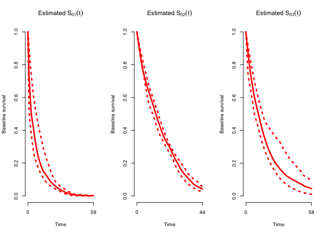
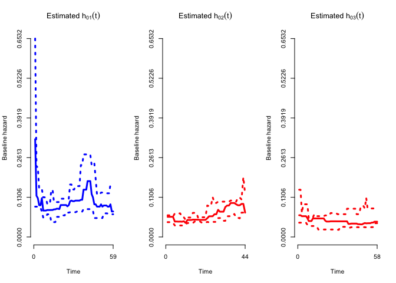
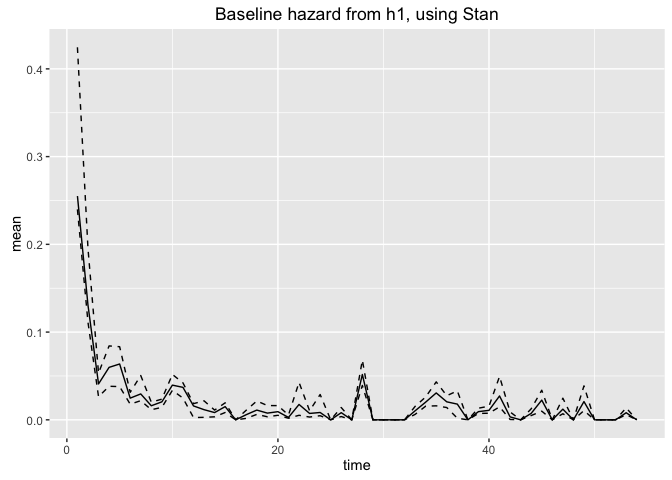
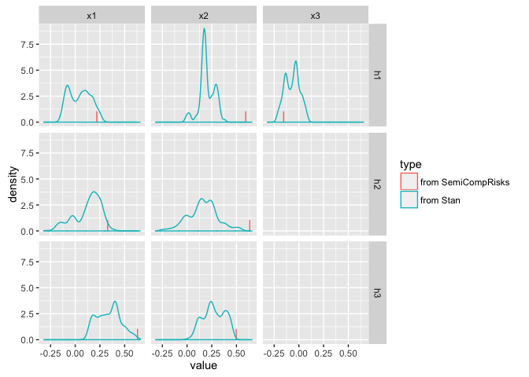

test-semicomp-risks
================
Jacqueline Buros
May 25, 2016

    ## Loading required package: ggplot2

    ## rstan (Version 2.9.0-3, packaged: 2016-02-11 15:54:41 UTC, GitRev: 05c3d0058b6a)

    ## For execution on a local, multicore CPU with excess RAM we recommend calling
    ## rstan_options(auto_write = TRUE)
    ## options(mc.cores = parallel::detectCores())

The goal of this document is to test the Stan file implementing semi-competing risks model in Stan. To test this code, we will compare the results to those generated by the SemiCompRisks package.

The first test data we will use is the `scrData` file provided by `SemiCompRisks`.

``` r
library(SemiCompRisks)
```

    ## Loading required package: MASS

    ## Loading required package: survival

``` r
library(dplyr)
```

    ## 
    ## Attaching package: 'dplyr'

    ## The following object is masked from 'package:MASS':
    ## 
    ##     select

    ## The following objects are masked from 'package:stats':
    ## 
    ##     filter, lag

    ## The following objects are masked from 'package:base':
    ## 
    ##     intersect, setdiff, setequal, union

``` r
library(rstan)
data(scrData)

## sample data for this analysis
set.seed(1234)
sample_data <- scrData %>% sample_n(200)
```

The first 4 columns of this data file will form our outcome vector, where event1 is a nonterminating event (e.g. illness or rehospitalization) and event2 is a terminating event (e.g. death).

The 5th column is a cluster ID, and the rest of the columns are covariates.

Here is the structure of the scrData:

``` r
str(scrData)
```

    ## 'data.frame':    2000 obs. of  8 variables:
    ##  $ time1  : num  2.929 0.631 34.362 19.059 1.52 ...
    ##  $ event1 : num  1 1 1 0 1 1 0 1 1 0 ...
    ##  $ time2  : num  60 7.38 60 19.06 60 ...
    ##  $ event2 : num  0 1 0 1 0 1 0 0 1 1 ...
    ##  $ cluster: int  1 32 1 6 1 26 24 14 14 29 ...
    ##  $ x1     : num  0.0301 -0.1957 -0.2254 -0.2945 -1.0085 ...
    ##  $ x2     : num  -0.761 0.515 1.102 2.16 0.279 ...
    ##  $ x3     : num  1.5455 0.7303 1.1685 -0.0549 1.0814 ...

Overview
--------

The `SemiCompRisks` package implements various survival & semi-competing risks models including both weibull & piecewise-exponential variations of the model.

This document will first replicate the basic Bayesian PEM (piecewise exponential model), and then estimate the PEM-MVN (version with correlated effects) since these are the models we intend to implement using Stan.

The SemiCompRisks package supports both a Markov model and a semi-Markov model, which differ in how they treat the time to terminating event in h3. Critically, in the **Markov model**, time to death following illness = time to death (irrespective of when illness occurred). In the **Semi-Markov model**, time to death following illness = time from illness to death.

Here, we implement h3 as a "Markov" model -- IE, the time to death is independent of the time to illness.

Implementing PEM model
----------------------

### Background on PEM model

(content TK)

### Estimation using SemiCompRisks

Here we complete the analysis following the details given in the documentation exactly.

Data inputs (outcome & the inputs to the three hazard submodels)

``` r
Y <- sample_data %>% dplyr::select(time1, event1, time2, event2)
## cluster <- sample_data %>% dplyr::select(cluster)
form1 <- as.formula( ~ x1 + x2 + x3)
form2 <- as.formula( ~ x1 + x2)
form3 <- as.formula( ~ x1 + x2)
lin.pred <- list(form1, form2, form3)
```

Hyperparameters (priors) for the 3 submodels

``` r
#####################
## Hyperparameters ##
#####################
## Subject-specific frailty variance component
## - prior parameters for 1/theta
##
theta.ab <- c(0.7, 0.7)

## PEM baseline hazard function
##
PEM.ab1 <- c(0.7, 0.7) # prior parameters for 1/sigma_1^2
PEM.ab2 <- c(0.7, 0.7) # prior parameters for 1/sigma_2^2
PEM.ab3 <- c(0.7, 0.7) # prior parameters for 1/sigma_3^2
##
PEM.alpha1 <- 10 # prior parameters for K1
PEM.alpha2 <- 10 # prior parameters for K2
PEM.alpha3 <- 10 # prior parameters for K3

## list to be passed to the BayesID function call
hyperParams <- list(theta=theta.ab,
                    WB=list(),
                    PEM=list(PEM.ab1=PEM.ab1,
                             PEM.ab2=PEM.ab2, 
                             PEM.ab3=PEM.ab3,
                             PEM.alpha1=PEM.alpha1, 
                             PEM.alpha2=PEM.alpha2, 
                             PEM.alpha3=PEM.alpha3
                             ),
                    MVN=list(),
                    DPM=list()
                    )
```

MCMC settings

``` r
###################
## MCMC SETTINGS ##
###################
## Setting for the overall run
##
numReps <- 2000
thin <- 10
burninPerc <- 0.5

## Settings for storage
##
nGam_save <- 0          ## nGam_save, the number of γ to be stored
storeV <- rep(TRUE, 3)  ## whether to store posterior samples from 3 submodels

## Tuning parameters for specific updates
##
## - common to all models
mhProp_theta_var <- 0.05
mhProp_Vg_var <- c(0.05, 0.05, 0.05)

##
## - specific to the PEM specification of the baseline hazard functions
Cg <- c(0.2, 0.2, 0.2)        ## sum should be <= 0.6
delPertg <- c(0.5, 0.5, 0.5)  ## perterbation parameter 
rj.scheme <- 1 #  If rj.scheme=1, the birth update will draw the proposal time split from 1 : smax. 
               #  If rj.scheme=2, the birth update will draw the proposal time split from uniquely ordered failure times in the data.
Kg_max <- c(50, 50, 50)  ## the maximum number of splits allowed at each iteration in MHG algorithm for PEM models
sg_max <- c(max(Y$time1[Y$event1 == 1]) ## max time to event for submodel 1 (progression only)
            , max(Y$time2[Y$event1 == 0 & Y$event2 == 1]) ## max time submodel 2 (death no progression)
            , max(Y$time2[Y$event1 == 1 & Y$event2 == 1]) ## max time submodel 3 (death following progression)
            )

time_lambda1 <- seq(1, sg_max[1], 1) # timepoints at which h1 events are calculated
time_lambda2 <- seq(1, sg_max[2], 1) # timepoints at which h2 events are calculated
time_lambda3 <- seq(1, sg_max[3], 1) # timepoints at which h3 events are calculated

##
mcmc.PEM <- list(run=list(numReps=numReps
                          , thin=thin
                          , burninPerc=burninPerc
                          )
                 , storage=list(nGam_save=nGam_save
                                , storeV=storeV
                                )
                 , tuning=list(mhProp_theta_var=mhProp_theta_var
                               , mhProp_Vg_var=mhProp_Vg_var
                               , Cg=Cg
                               , delPertg=delPertg
                               , rj.scheme=rj.scheme
                               , Kg_max=Kg_max
                               , time_lambda1=time_lambda1 
                               , time_lambda2=time_lambda2
                               , time_lambda3=time_lambda3
                               )
                 )
```

Executing the model

``` r
##
myModel <- c("Markov", "PEM")
myPath <- "Output/02-Results-PEM/"
startValues <- vector("list", 2)
startValues[[1]] <- initiate.startValues(Y, lin.pred, sample_data, model=myModel)
```

    ## 
    ## [1] "Start values are initiated for semi-competing risks PEM model..."

``` r
startValues[[2]] <- initiate.startValues(Y, lin.pred, sample_data, model=myModel, theta = 0.23)
```

    ## 
    ## [1] "Start values are initiated for semi-competing risks PEM model..."

``` r
##
fit_PEM <- BayesID(Y, lin.pred, sample_data, cluster=NULL, model=myModel, hyperParams, startValues, mcmc.PEM, path=myPath)
```

    ## chain:  1 
    ## chain:  2

``` r
fit_PEM
```

    ## 
    ## Analysis of independent semi-competing risks data 
    ## Markov assumption for h3
    ## 
    ## Number of chains:     2 
    ## Number of scans:      2000 
    ## Thinning:             10 
    ## Percentage of burnin: 50%
    ## 
    ## ######
    ## Potential Scale Reduction Factor
    ## 
    ## Variance of frailties, theta:     
    ##  1.12
    ## 
    ## Regression coefficients:
    ##    beta1 beta2 beta3
    ## x1 1.438 1.024 0.995
    ## x2 1.008 1.059 1.028
    ## x3 1.602    NA    NA
    ## 
    ## Baseline hazard function components:
    ## 
    ## lambda1: summary statistics 
    ##    Min. 1st Qu.  Median    Mean 3rd Qu.    Max. 
    ##   1.001   1.136   1.424   1.767   2.366   4.000 
    ## 
    ## lambda2: summary statistics 
    ##    Min. 1st Qu.  Median    Mean 3rd Qu.    Max. 
    ##   1.004   1.280   1.774   1.946   2.097   4.800 
    ## 
    ## lambda3: summary statistics 
    ##    Min. 1st Qu.  Median    Mean 3rd Qu.    Max. 
    ##   1.003   1.061   1.125   1.367   1.263   2.889 
    ## 
    ##            h1    h2    h3
    ## mu      1.014 1.287 1.096
    ## sigmaSq 1.241 1.308 0.995
    ## K       2.117 0.996 1.026
    ## 
    ## ######
    ## Estimates
    ## 
    ## Variance of frailties, theta:
    ##  Estimate    SD    LL    UL
    ##     1.389 0.225 1.043 2.002
    ## 
    ## Regression coefficients:
    ##    Estimate    SD    LL    UL
    ## x1    0.218 0.184 1.032 1.824
    ## x2    0.593 0.096 1.407 1.928
    ## x3   -0.154 0.104 0.778 0.993
    ## x1    0.328 0.155 0.977 1.886
    ## x2    0.634 0.180 1.175 2.184
    ## x1    0.630 0.085 1.683 2.195
    ## x2    0.497 0.140 1.283 2.379

``` r
summ.fit_PEM <- summary(fit_PEM); names(summ.fit_PEM)
```

    ## [1] "classFit" "psrf"     "theta"    "coef"     "h0"       "lambda1" 
    ## [7] "lambda2"  "lambda3"  "setup"

``` r
summ.fit_PEM
```

    ## 
    ## Analysis of independent semi-competing risks data 
    ## Markov assumption for h3
    ## 
    ## #####
    ## 
    ## Hazard ratios:
    ##    exp(beta1)    LL    UL exp(beta2)    LL    UL exp(beta3)    LL    UL
    ## x1      1.244 1.032 1.824      1.389 0.977 1.886      1.878 1.683 2.195
    ## x2      1.809 1.407 1.928      1.885 1.175 2.184      1.644 1.283 2.379
    ## x3      0.858 0.778 0.993         NA    NA    NA         NA    NA    NA
    ## 
    ## Variance of frailties:
    ##  theta    LL    UL
    ##  1.389 1.043 2.002
    ## 
    ## Baseline hazard function components:
    ##          h1-PM     LL     UL  h2-PM     LL     UL  h3-PM     LL     UL
    ## mu      -2.081 -3.012 -0.791 -2.587 -3.168 -1.951 -2.806 -3.719 -1.916
    ## sigmaSq  0.791  0.285  4.562  0.340  0.125  0.750  0.772  0.129  2.061
    ## K       12.000  8.000 15.025 10.000  6.000 14.000  6.000  3.000 13.000

Plotting at the results

``` r
plot(fit_PEM)
```

<!-- -->

``` r
plot(fit_PEM, plot.est = "BH")
```

<!-- -->

``` r
#names(fit_PEM.plot <- plot(fit_PEM, plot=FALSE))
```

### Implementing the model in Stan

The Stan implementation of this model requires that data be provided in a "long" or denormalized format.

Data should have one observation per unique event time (failure or progression) per subject. Each data element should have covariate values (in this case, x1, x2 & x3) provided with each observation.

Before doing any analysis, let's put the data into this structure.

``` r
#' @param time_precision decimal points to use when rounding time (e.g. 0 = nearest integer)
#' @returns a data frame
reformat_data <- function(data, time_precision = 2) {
  
  subjd <- data %>%
    dplyr::mutate(subject_id = row_number())
    
  ## rearrange data so that progression & failure events are on separate rows
  d <- subjd %>%
    tidyr::gather(var, val, starts_with('time'), starts_with('event')) %>%
    dplyr::mutate(event_type = gsub(var,pattern=".*(\\d)$",replacement="\\1")
                  , var = gsub(var,pattern="(.*)(\\d)$",replacement="\\1")
                  ) %>%
    tidyr::spread(var, val) %>%
    dplyr::rename(outcome = event)
  
  ## round failure times to nearest X 
  d <- 
    d %>%
    dplyr::mutate(time = round(time, time_precision)) 
  
  ## identify unique failure timepoints
  d <- d %>%
    dplyr::mutate(timepoint_id = as.integer(factor(time, ordered = TRUE)))
  
  tps <- d %>%
    dplyr::distinct(timepoint_id) %>%
    dplyr::select(timepoint_id, time) %>%
    dplyr::arrange(timepoint_id) %>%
    dplyr::rename(time_to = time) %>%
    dplyr::mutate(time_from = dplyr::lag(time_to, n = 1, order_by = timepoint_id)
                  , duration = ifelse(timepoint_id == 1, 10^(-1*time_precision), time_to - time_from)
                  )

  ## could be made *MUCH* more efficient -- don't need cum/functions
  longd <- expand.grid(list(subject_id = seq_len(nrow(data)), timepoint_id = seq_len(nrow(tps)))) %>%
    as.data.frame() %>%
    dplyr::inner_join(d %>% dplyr::rename(event_timepoint = timepoint_id), by = 'subject_id') %>%
    dplyr::mutate(progression = ifelse(event_type == 1 & outcome == 1 & timepoint_id == event_timepoint, 1, 0)
                  , failure = ifelse(event_type == 2 & outcome == 1 & timepoint_id == event_timepoint, 1, 0)
                  , censor = ifelse(event_type == 2 & outcome == 0 & timepoint_id == event_timepoint, 1, 0)
                  ) %>%
    dplyr::group_by(subject_id, timepoint_id) %>%
    dplyr::mutate(progression = max(progression)
                  , failure = max(failure)
                  , censor = max(censor)
                  ) %>%
    dplyr::group_by(subject_id) %>%
    dplyr::arrange(timepoint_id) %>%
    dplyr::mutate(post_progression = cummax(progression) - progression
                  , post_failure = cummax(failure) - failure
                  , post_censor = cummax(censor) - censor
                  ) %>%
    ungroup() %>%
    dplyr::filter(post_failure == 0 & post_censor == 0) %>%
    dplyr::select(-event_timepoint, -time, -outcome, -event_type) %>%
    unique()
  
    ## confirm no duplicates by subject/timepoint
    stopifnot(all(duplicated(cbind(longd$subject_id, longd$timepoint_id))==FALSE))
    
    ## confirm number of events the same as in original data 
    stopifnot(sum(data$event1) == sum(longd$progression))
    stopifnot(sum(data$event2) == sum(longd$failure))
  
  longd %>% inner_join(tps, by = 'timepoint_id')
}

d <- reformat_data(sample_data, time_precision = 0.01)
str(d)
```

    ## Classes 'tbl_df' and 'data.frame':   7057 obs. of  15 variables:
    ##  $ subject_id      : int  1 1 1 1 1 1 2 2 2 2 ...
    ##  $ timepoint_id    : int  1 2 3 4 5 6 1 2 3 4 ...
    ##  $ cluster         : int  11 11 11 11 11 11 7 7 7 7 ...
    ##  $ x1              : num  -0.0779 -0.0779 -0.0779 -0.0779 -0.0779 ...
    ##  $ x2              : num  -0.304 -0.304 -0.304 -0.304 -0.304 ...
    ##  $ x3              : num  -1.39 -1.39 -1.39 -1.39 -1.39 ...
    ##  $ progression     : num  0 0 0 0 0 0 0 0 0 0 ...
    ##  $ failure         : num  0 0 0 0 0 1 0 0 0 0 ...
    ##  $ censor          : num  0 0 0 0 0 0 0 0 0 0 ...
    ##  $ post_progression: num  0 0 0 0 0 0 0 0 0 0 ...
    ##  $ post_failure    : num  0 0 0 0 0 0 0 0 0 0 ...
    ##  $ post_censor     : num  0 0 0 0 0 0 0 0 0 0 ...
    ##  $ time_to         : num  0 1 2 3 4 5 0 1 2 3 ...
    ##  $ time_from       : num  NA 0 1 2 3 4 NA 0 1 2 ...
    ##  $ duration        : num  0.977 1 1 1 1 ...

Next, we prepare the inputs to stan as a list of data elements

``` r
standata <- list(
  ## dimensions
  N = nrow(d)
  , S = n_distinct(d$subject_id)
  , T = n_distinct(d$timepoint_id)
  , X = 3 ## number of covars
  
  ## data 
  , s_id = d$subject_id
  , t_id = d$timepoint_id
  , t_dur = d$duration
  , t_time = d$time_to
  , ev1 = d$progression
  , ev2 = d$failure
  , post_ev1 = d$post_progression
  , x = d %>% dplyr::select(x1, x2, x3)
  
  # which covariates inform which model 
  , x1 = c(1, 1, 1)  ## model1 includes all 3 covariates
  , x2 = c(1, 1, 0)  ## model2 includes first 2
  , x3 = c(1, 1, 0)  ## model3 includes first 2
)
```

Let's review the stan code for this model.

Now, let's try running the model

``` r
testfit <- stan(
  file = file.path(stanfile_dir, 'semi_competing_risks_model.stan')
  , data = standata
  , chains = 1
  , iter = 10
  , control = list(adapt_delta = 0.95)
)
```

    ## 
    ## SAMPLING FOR MODEL 'semi_competing_risks_model' NOW (CHAIN 1).
    ## 
    ## Chain 1, Iteration: 1 / 10 [ 10%]  (Warmup)
    ## Chain 1, Iteration: 2 / 10 [ 20%]  (Warmup)
    ## Chain 1, Iteration: 3 / 10 [ 30%]  (Warmup)
    ## Chain 1, Iteration: 4 / 10 [ 40%]  (Warmup)
    ## Chain 1, Iteration: 5 / 10 [ 50%]  (Warmup)
    ## Chain 1, Iteration: 6 / 10 [ 60%]  (Sampling)
    ## Chain 1, Iteration: 7 / 10 [ 70%]  (Sampling)
    ## Chain 1, Iteration: 8 / 10 [ 80%]  (Sampling)
    ## Chain 1, Iteration: 9 / 10 [ 90%]  (Sampling)
    ## Chain 1, Iteration: 10 / 10 [100%]  (Sampling)# 
    ## #  Elapsed Time: 0.2537 seconds (Warm-up)
    ## #                0.461893 seconds (Sampling)
    ## #                0.715593 seconds (Total)
    ## #

    ## The following numerical problems occured the indicated number of times after warmup on chain 1

    ##                                                                                        count
    ## Exception thrown at line 130: poisson_log: Rate parameter is nan, but must not be nan!     2
    ## Exception thrown at line 126: poisson_log: Rate parameter is nan, but must not be nan!     1

    ## When a numerical problem occurs, the Metropolis proposal gets rejected.

    ## However, by design Metropolis proposals sometimes get rejected even when there are no numerical problems.

    ## Thus, if the number in the 'count' column is small, do not ask about this message on stan-users.

``` r
stanfit <- stan(
  fit = testfit
  , data = standata
  , chains = 3
  , iter = 800
  , control = list(adapt_delta = 0.95)
  )
```

    ## Warning: There were 933 divergent transitions after warmup. Increasing
    ## adapt_delta above 0.95 may help.

    ## Warning: There were 335 transitions after warmup that exceeded the maximum
    ## treedepth. Increase max_treedepth above 10.

    ## Warning: Examine the pairs() plot to diagnose sampling problems

Compare results to those from the SemiCompRisks package.

Start by comparing the "baseline" hazard functions. If these aren't computed similarly, then we can't expect coefficient estimates to be similar.

``` r
### from stan 
baseline_h1 <- 
  rstan::extract(stanfit, 'h0_m1')$h0_m1

baseline_stan1 <- data.frame(time = seq_len(ncol(baseline_h1))
                             , mean = apply(baseline_h1 , MARGIN = 2, median)
                             , lower = apply(baseline_h1, MARGIN = 2, function(x) quantile(x, probs = 0.25))
                             , upper = apply(baseline_h1, MARGIN = 2, function(x) quantile(x, probs = 0.75))
                             )

## plot estimated baseline hazard using Stan
ggplot(data = baseline_stan1, aes(x = time)) + 
  geom_line(aes(y = mean)) + 
  geom_line(aes(y = lower), linetype = 'dashed') + 
  geom_line(aes(y = upper), linetype = 'dashed') + 
  ggtitle('Baseline hazard from h1, using Stan')
```

<!-- -->

``` r
## Compare to estimated baseline hazard using SemiCompRisks
plot(fit_PEM, plot.est = "BH")
```

<!-- -->

Next we compare the coefficient estimates obtained from each method.

``` r
allres <- NULL
## estimates from h1 using semi-comp-risks
for (m in seq_len(3)) {
  
  predval <- unlist(lapply(summ.fit_PEM$coef[,stringr::str_c('exp(beta',m,')')], log)) %>% 
    purrr::keep(~!is.na(.))
  
  ## estimates from SemiCompRisks
  res <- predval %>% 
    as.list() %>% 
    purrr::transpose() %>% 
    as.data.frame() %>%
    dplyr::mutate(type = 'from SemiCompRisks'
                  , model = stringr::str_c('h',m)
                  )
  
  ext <- extract(stanfit, stringr::str_c('beta_m',m))[[stringr::str_c('beta_m',m)]] %>%
    as.data.frame() 
  names(ext) <- names(predval)
  allres <- ext %>%
    dplyr::select(one_of(names(predval))) %>%
    dplyr::mutate(type = 'from Stan'
                  , model = stringr::str_c('h',m)
                  ) %>%
    dplyr::bind_rows(res) %>%
    dplyr::bind_rows(allres)
  

}

## estimates from Stan model

ggplot(allres %>% 
         tidyr::gather(coefname, value, -type, -model)
       , aes( x = value, group = type, colour = type)) + 
  facet_grid(model ~ coefname) + geom_density()
```

    ## Warning: Removed 2402 rows containing non-finite values (stat_density).

<!-- -->
