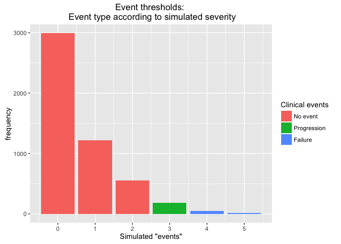
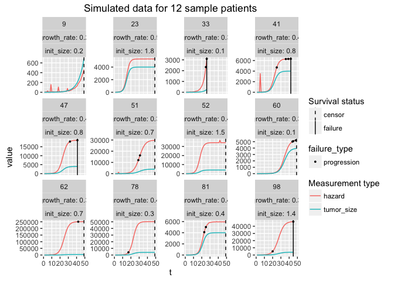
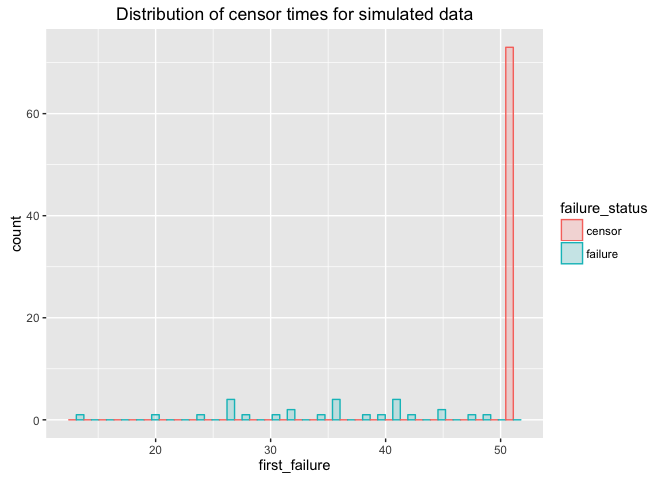
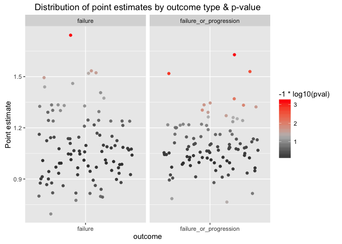
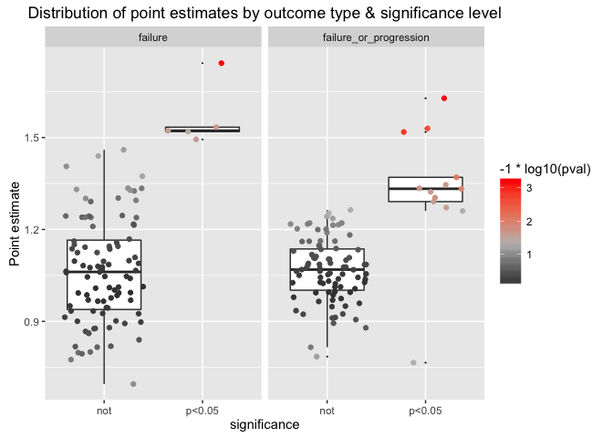

Bootstrap survival analysis
================
Jacqueline Buros
May 20, 2016

``` r
suppressMessages(suppressWarnings({
  library(dplyr)
  library(ggplot2)
  library(tidyr)
  library(purrr)
  library(survival)
  source('simulate-data.function.R')
  source('prep-data.function.R')
  source('make-data-plots.function.R')
  source('simulate-survival-analysis.function.R')
}))
```

Introduction
------------

We're going to consider the scenario in which we have simulated data according to the generative model, as if we didn't know how the data were generated.

IE rather than analyze according to the generative model, we will do an association test to see which covariates of interest are correlated with our outcome.

Review data simulation process
------------------------------

First step is to review the data-simulation process.

The simulation code are encapsulated in the **simulate\_data** function:

``` r
source('simulate-data.function.R')
```

This function takes a lot of parameters, so that the probabilities that go into the simulation can be customized.

Here we will call it with fairly standard inputs :

``` r
d <- simulate_data(n = 100, max_size = 4000, max_t = 50, failure_threshold = 4, progression_threshold = 3)
```

Most of the post-processing has been scripted into two helper functions: **prep\_data()** and **make\_data\_plots()**.

First, we review the simulated data:

``` r
source('make-data-plots.function.R')
make_data_plots(d)
```

    ## Saving 7 x 5 in image

<!-- -->

    ## Saving 7 x 5 in image

<!-- -->

    ## `stat_bin()` using `bins = 30`. Pick better value with `binwidth`.
    ## Saving 7 x 5 in image

    ## `stat_bin()` using `bins = 30`. Pick better value with `binwidth`.

<!-- -->

Then, we rescale / center covariates for analysis:

``` r
source('prep-data.function.R')
res <- prep_data(d)
```

    ## Source: local data frame [3 x 4]
    ## 
    ##   failure_status failure_or_progression_status     n percent
    ##            (dbl)                         (dbl) (int)   (chr)
    ## 1              0                             0    10     10%
    ## 2              0                             1    43     43%
    ## 3              1                             1    47     47%

``` r
adata <- res$per_observation
survd <- res$per_patient
rm(res)
```

Review standard analysis
------------------------

The hypothetical analysis we will consider here is a survival analysis, with the initial tumor diameter as the covariate.

Here we count "failure" as the outcome of interest.

``` r
library(survival)
survfit <- coxph(
   formula = Surv(first_failure, failure_status) ~ rescaled_init_size
   , data = survd
   )
print(survfit)
```

    ## Call:
    ## coxph(formula = Surv(first_failure, failure_status) ~ rescaled_init_size, 
    ##     data = survd)
    ## 
    ## 
    ##                     coef exp(coef) se(coef)    z    p
    ## rescaled_init_size 0.171     1.186    0.148 1.15 0.25
    ## 
    ## Likelihood ratio test=1.31  on 1 df, p=0.252
    ## n= 100, number of events= 47

Alternatively, we can consider first progression and/or failure as the outcome:

``` r
survfit2 <- coxph(
  formula = Surv(first_failure_or_progression, failure_or_progression_status) ~ rescaled_init_size
  , data = survd
  )
print(survfit2)
```

    ## Call:
    ## coxph(formula = Surv(first_failure_or_progression, failure_or_progression_status) ~ 
    ##     rescaled_init_size, data = survd)
    ## 
    ## 
    ##                      coef exp(coef) se(coef)    z    p
    ## rescaled_init_size 0.0286    1.0291   0.1098 0.26 0.79
    ## 
    ## Likelihood ratio test=0.07  on 1 df, p=0.794
    ## n= 100, number of events= 90

Now, depending on the particular draw / random seed the simulation used, this covariate might or might not be "significantly" associated with either of the two outcomes.

How likely is this to happen by chance alone?

Simulate 100s of draws
----------------------

To answer this, we have wrapped the simulate data -&gt; run analysis -&gt; inspect results process in a function, called **simulate\_survival\_analysis()**. By default, this function takes the same inputs as we used above.

Let's run it 100 times to see how likely we are to pick up the importance of tumor size in patient risk.

``` r
source('simulate-survival-analysis.function.R')

## run process 100x (simulate data, estimate model for association)
res <- map(seq_len(100), ~simulate_survival_analysis())

## (output suppressed)
```

... then, format results for presentation

``` r
rdata <- 
  res %>% 
  flatten() %>% 
  map_df(~data.frame(
    outcome = .$outcome
    , estimate = .$estimate[1]
    , pval = .$pval
    , concordance = .$concordance
    )) %>%
  mutate(significance = ifelse(pval < 0.05, 'p<0.05', ifelse(pval < 0.01, 'p<0.01', 'not')))
```

    ## Warning in rbind_all(x, .id): Unequal factor levels: coercing to character

Results
-------

Distribution of point estimates by outcome type & by -log10(p-value)

``` r
ggplot(rdata, aes(y = estimate, x = outcome, colour = -1*log10(pval))) + 
  geom_jitter() + 
  facet_wrap(~outcome, scale = 'free_x', nrow = 1) + 
  scale_colour_gradient2(low = 'black', mid = 'grey', high  = 'red', midpoint = -1 * log10(0.05)) +
  scale_y_continuous('Point estimate') +
  ggtitle('Distribution of point estimates by outcome type & p-value')
```

<!-- -->

Sample plot, separated by "significance level"

``` r
ggplot(rdata, aes(y = estimate, x = significance, colour = -1*log10(pval))) + 
  geom_boxplot(aes(x = significance, y = estimate, colour = NULL), outlier.size = 0) + 
  geom_jitter() + facet_wrap(~outcome, scale = 'free_x', nrow = 1) + 
  scale_colour_gradient2(low = 'black', mid = 'grey', high  = 'red', midpoint = -1 * log10(0.05)) +
  scale_y_continuous('Point estimate') +
  ggtitle('Distribution of point estimates by outcome type & significance level')
```

<!-- -->

Summarize which percent of observations would pass the "traditional" significance test

.. is a decent approximation to how powered we would be to detect this effect with a sample size of 100.

``` r
rdata %>%
  group_by(outcome) %>%
  mutate(n_tests = n()) %>%
  group_by(outcome, significance) %>%
  summarise(n = n()
         , percent = unique(paste0(round(n / n_tests * 100,0),'%'))
         ) %>%
  ungroup() %>%
  dplyr::select(-n) %>%
  tidyr::spread( significance, percent)
```

    ## Source: local data frame [2 x 3]
    ## 
    ##                  outcome   not p<0.05
    ##                    (chr) (chr)  (chr)
    ## 1                failure   87%    13%
    ## 2 failure_or_progression   86%    14%
