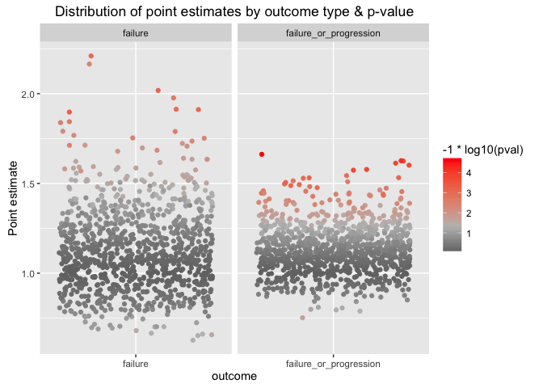
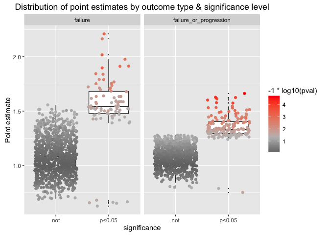

Bootstrap survival analysis
================
Jacqueline Buros
May 20, 2016

Introduction
------------

We're going to consider the scenario in which we have simulated data according to the generative model, as if we didn't know how the data were generated.

We have done this previously using the default settings for simulate data. Here we repeat that process with goal of determining which simulation parameters most impact the power.

Simulate 100s of draws
----------------------

As a reminder, we have wrapped the simulate data -&gt; run analysis -&gt; inspect results process in a function, called **simulate\_survival\_analysis()**. By default, this function takes the same inputs as we used above.

Here we run the process 1000 times to see how likely we are to pick up the importance of tumor size in patient risk.

Hazard proportional to tumor size
---------------------------------

``` r
## run process 1000x (simulate data, estimate model for association)
res <- map(seq_len(1000)
           , ~simulate_survival_analysis(
             hazard_noise_fun = create_scalar(0)
             , hazard_fun = function(row) {row$tumor_size} ## for now, hazard proportional to size
           ))

## (output suppressed)
```

... then, format results for presentation

``` r
rdata <- 
  res %>% 
  flatten() %>% 
  map_df(~data.frame(
    outcome = .$outcome
    , estimate = .$estimate[1]
    , pval = .$pval
    , concordance = .$concordance
    )) %>%
  mutate(significance = ifelse(pval < 0.05, 'p<0.05', ifelse(pval < 0.01, 'p<0.01', 'not')))
```

    ## Warning in rbind_all(x, .id): Unequal factor levels: coercing to character

Results
-------

Distribution of point estimates by outcome type & by -log10(p-value)

``` r
ggplot(rdata, aes(y = estimate, x = outcome, colour = -1*log10(pval))) + 
  geom_jitter() + 
  facet_wrap(~outcome, scale = 'free_x', nrow = 1) + 
  scale_colour_gradient2(low = 'black', mid = 'grey', high  = 'red', midpoint = -1 * log10(0.05)) +
  scale_y_continuous('Point estimate') +
  ggtitle('Distribution of point estimates by outcome type & p-value')
```

<!-- -->

Sample plot, separated by "significance level"

``` r
ggplot(rdata, aes(y = estimate, x = significance, colour = -1*log10(pval))) + 
  geom_boxplot(aes(x = significance, y = estimate, colour = NULL), outlier.size = 0) + 
  geom_jitter() + facet_wrap(~outcome, scale = 'free_x', nrow = 1) + 
  scale_colour_gradient2(low = 'black', mid = 'grey', high  = 'red', midpoint = -1 * log10(0.05)) +
  scale_y_continuous('Point estimate') +
  ggtitle('Distribution of point estimates by outcome type & significance level')
```

<!-- -->

Summarize which percent of observations would pass the "traditional" significance test

.. is a decent approximation to how powered we would be to detect this effect with a sample size of 100.

``` r
rdata %>%
  group_by(outcome) %>%
  mutate(n_tests = n()) %>%
  group_by(outcome, significance) %>%
  summarise(n = n()
         , percent = unique(paste0(round(n / n_tests * 100,0),'%'))
         ) %>%
  ungroup() %>%
  dplyr::select(-n) %>%
  tidyr::spread( significance, percent)
```

    ## Source: local data frame [2 x 3]
    ## 
    ##                  outcome   not p<0.05
    ##                    (chr) (chr)  (chr)
    ## 1                failure   92%     8%
    ## 2 failure_or_progression   84%    16%
